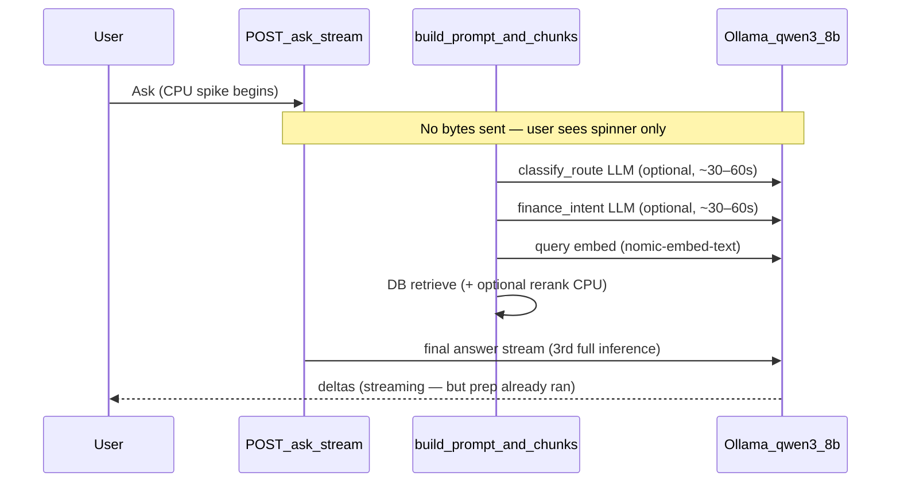

# Reduce Ask CPU load (spread work, fewer model runs)

## What is actually happening

Streaming is wired correctly in [`static/index.html`](static/index.html) (`POST /ask/stream` → NDJSON `{delta}` lines), but **the server sends nothing until the entire prep pipeline finishes** in [`app/main.py`](app/main.py) (`build_prompt_and_chunks` + `rate_limiter.acquire()` happen *before* `StreamingResponse` starts).



**Why the machine overheats:** each prep step is a full local inference on `qwen3:8b` ([`.env.example`](.env.example) default). Preset chips like “What’s maturing soon?” can be answered from structured DB data ([`app/dashboard.py`](app/dashboard.py) already does this deterministically for Home), but Ask still pays for routing LLM calls unless heuristics skip them.

**Concurrent load:** the ingest background worker ([`app/ingest_worker.py`](app/ingest_worker.py)) also calls Ollama for embeddings/vision while Ask runs. Ingest already paces jobs (`INGEST_QUEUE_INTER_JOB_SLEEP_SEC=3`); Ask does not.

---

## Strategy (three layers)

| Layer | Goal | User experience |
|-------|------|-----------------|
| **A. Fewer model runs** | Skip prep LLMs when we know the route | Same wait, much less CPU |
| **B. Serialize + pace** | Never run multiple Ollama jobs at once | Slower but machine stays cool |
| **C. Background Ask jobs** | Move work off the request thread | “Come back in ~10 min — safe to leave” |

Implement A + B first (small diff, big CPU win). Add C because you explicitly OK’d async wait over overheating.

---

## Layer A — Cut LLM count (highest impact, no new infra)

### A1. Deterministic fast paths for preset questions

Map the five preset chips in [`static/index.html`](static/index.html) to **zero- or one-LLM** handlers in [`app/ask_graph.py`](app/ask_graph.py) (or a new `app/ask_fast_paths.py`):

| Preset question | Data source | LLM calls |
|-----------------|-------------|-----------|
| What's maturing soon? | `dashboard.build_dashboard_data()` → `upcoming_maturing`, `overdue_maturing` | **0** — format as markdown table |
| How much in CDs? | `list_positions` filtered by CD-like `asset_type`, sum `principal` | **0** |
| Bills due soon? | `list_obligations` within `OBLIGATION_DAYS_AHEAD` | **0** |
| Summarize accounts | `list_accounts` + `list_positions` | **0** (or optional 1 small format pass) |
| Find tax documents (1099) | embed + retrieve only | **1** (skip classifier + finance intent) |

Reuse formatting helpers from [`app/dashboard.py`](app/dashboard.py) (`_format_money`, item builders). Return through the same `/ask/stream` NDJSON shape (`answer` + `structured` + `done`, no deltas needed).

### A2. Strengthen heuristic routing (skip prep LLMs)

In [`app/ask_graph.py`](app/ask_graph.py), ensure:

- **`classify_route`**: keyword/heuristic match for maturity, CD, obligation, account, document-search intents → set route without LLM.
- **`fetch_finance_tools`**: skip finance-intent LLM unless question mentions stocks/ticker/compound/APY calculator patterns; skip entirely when `FINANCE_TOOLS_BASE_URL` is empty ([`app/config.py`](app/config.py) already defaults empty).
- **Never run classifier + finance intent + answer when route is `structured_data` or fast-path.**

Add/extend unit tests (referenced in git as [`tests/test_ask_graph_unit.py`](tests/test_ask_graph_unit.py)): preset questions must assert **0 prep LLM calls** via mocks.

### A3. Portable profile defaults

When `LEDGERLY_PROFILE=portable|low_spec` ([`app/config.py`](app/config.py) `_portable_profile()`):

- Default `LLM_MODEL` to a smaller model (e.g. `qwen2.5:3b`) if unset — mirror existing portable logic for `LLAVA_MODEL`.
- Default `LLM_INTER_CALL_SLEEP_SEC=2` (currently **0** — no pacing).
- Document `OLLAMA_NUM_THREADS=4` (or lower) in [`.env.example`](.env.example) and setup docs.

---

## Layer B — Serialize Ollama work (spread load, prevent pile-up)

### B1. Global Ollama semaphore

Add `app/ollama_guard.py`:

- `async with ollama_guard:` around **every** Ollama HTTP call in `llm_client`, `embeddings_client`, and vision paths.
- Default **`OLLAMA_MAX_CONCURRENT=1`** for portable profile.
- Shared by Ask, ingest worker, and `/ask/image` so ingest + ask cannot double-spike CPU.

### B2. Mandatory cool-down between local LLM calls in Ask graph

Use existing `LLM_INTER_CALL_SLEEP_SEC` ([`app/config.py`](app/config.py) line 69) — wire it in `ask_graph` before each prep LLM call (config comment says this is intended but default is 0).

Optional: `ASK_COOLDOWN_AFTER_PREP_SEC` — short pause after graph build before starting the streaming answer so the CPU can breathe.

### B3. Block or warn when ingest is busy

Before starting Ask graph build, check [`app/ingest_queue.py`](app/ingest_queue.py) for a running job:

- **Gentle mode (default portable):** return 409/503 with message “Document processing is running — Ask will start when it finishes” or auto-queue (Layer C).
- **UI:** show banner on Ask panel when ingest job active (poll `/ingest/jobs` like ingest UI already does).

---

## Layer C — Background Ask jobs (“come back in 10 minutes”)

Reuse the ingest queue pattern ([`app/ingest_worker.py`](app/ingest_worker.py), [`app/ingest_queue.py`](app/ingest_queue.py)):

### C1. API

- `POST /ask/jobs` → **202** `{ job_id, estimated_wait_sec }` — enqueue question.
- `GET /ask/jobs/{id}` → `{ status, stage, progress_pct, eta_seconds, answer?, error? }`.
- Single-threaded `ask_worker_loop` in `app/ask_worker.py` — one question at a time, `ASK_QUEUE_INTER_JOB_SLEEP_SEC` between jobs (default 5s).

Stages for progress: `routing` → `retrieving` → `generating` → `done`.

### C2. UI ([`static/index.html`](static/index.html))

- When `LEDGERLY_PROFILE=portable` **or** server returns `AskMode: "queued"` from `/health`, default Ask form to queued mode.
- Show: “Your answer is being prepared. This can take several minutes on this machine. **You can leave this page** — check Past questions when you return.”
- Poll job status (reuse ingest poll interval `INGEST_UI_POLL_INTERVAL_SEC`).
- Keep `/ask/stream` as “Answer now (uses more CPU)” advanced option in a `<details>` block.

### C3. Past questions hook

Wire completed ask jobs into existing “Past questions” panel (`/decision/history` area) or a small `ask_history` table so async answers are retrievable.

---

## Layer D — UX honesty (even on sync path)

Small changes while Layers A–C land:

1. **Hide spinner on first useful byte** — `top_chunks`, `answer`, or `{phase:…}` NDJSON, not only `delta` ([`static/index.html`](static/index.html) ~3018).
2. **Phase NDJSON from server** — yield `{ "phase": "routing" }`, `{ "phase": "searching" }` from `_stream_ask_generator` / graph callbacks so loading text updates.
3. **Client timeout** — `AbortSignal` at ~15 min with clear error (prevents infinite spinner if Ollama hangs).

---

## Diagnosis checklist (before/after changes)

1. Enable `LOG_JSON=true`, ask one preset question, grep logs for `ask_trace` + `X-Request-ID`.
2. Count `llm_completion` events per request — **target: 1** for presets, **≤2** for document search.
3. Watch for overlap: ingest job `stage=embedding` + Ask at same timestamp → should not happen after B1.
4. Log lines to compare: `Ask/stream: graph build done` vs `first LLM delta` — build time should drop from ~90s to &lt;2s on fast paths.

---

## Recommended implementation order

1. **A1 + A2** — deterministic presets + heuristic skips (biggest CPU win, ~1 day)
2. **B1 + B2** — Ollama semaphore + inter-call sleep defaults for portable (~0.5 day)
3. **D** — spinner/phase UX (~0.5 day)
4. **C** — background ask queue + UI (~1–2 days)
5. **A3 + docs** — portable env defaults, Ollama thread guidance

---

## Config quick reference (for immediate relief before code ships)

Users can set today in `.env`:

```env
LEDGERLY_PROFILE=portable
LLM_MODEL=qwen2.5:3b
LLM_INTER_CALL_SLEEP_SEC=2
FINANCE_TOOLS_BASE_URL=
RERANK_ENABLED=false
INGEST_QUEUE_INTER_JOB_SLEEP_SEC=5
OLLAMA_NUM_THREADS=4
```

Unset `OPENAI_API_KEY` avoids Home `/decision` OpenAI calls (cloud, not local CPU — but reduces parallel network work).
