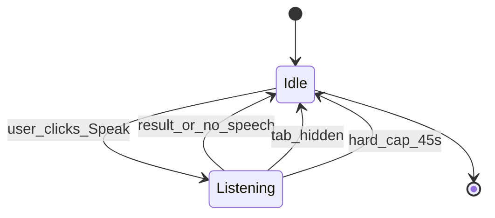

# Ask microphone idle safety

## Is a timeout good practice?

**Yes.** Limiting how long the mic stays active is standard for privacy, battery, and UI hygiene — especially on the portable profile where every idle subsystem counts.

**100 seconds alone is safe but not ideal** for this feature:

| Factor | What happens today | With 100s cap only |
|--------|-------------------|-------------------|
| User speaks a normal question | Browser VAD ends session after ~1–2s silence (`continuous: false`) | No change |
| User clicks mic and says nothing | Browser usually fires `no-speech` → `onend` within seconds | Mic could stay “Listening…” up to 100s if `onend` misbehaves |
| User walks away | Mic may linger until browser timeout (~60s in Chrome) | Still up to 100s of unnecessary capture |
| Tab hidden / switched away | **No cleanup today** | Still listening in background tab |

For Ledgerly’s Ask flow — one short question, auto-submit on result — **~45s hard cap + stop when the tab is hidden** matches intent better than 100s alone.



---

## Current code ([`static/index.html`](static/index.html) ~3358–3399)

The mic handler uses `SpeechRecognition` with `continuous: false`. It disables the button and shows “Listening…” on start, then resets in `onend` / `onerror`. There is **no** `rec.stop()` safety net, **no** `isListening` flag, and **no** visibility handler for speech.

Risk: if `onend` never fires (browser edge case), the button stays disabled and “Listening…” persists — exactly the “walked away” stuck state you’re worried about.

---

## Recommended implementation (layered)

All changes stay inside `bindAskMic()` in [`static/index.html`](static/index.html) — no server changes.

### 1. Central `stopListening(reason)` helper

- Guard with `isListening` boolean.
- Call `rec.stop()` inside try/catch (idempotent).
- Clear any pending `setTimeout` hard-cap timer.
- Reset UI: hide status, re-enable mic button.
- Optionally set status text briefly: **“Stopped listening — tap Speak again when ready.”** (use existing `#ask-mic-status` or `#ask-message` with neutral styling, not error red).

### 2. Hard cap: `ASK_MIC_MAX_LISTEN_MS = 45000` (45s)

- Start timer in `onstart` (or immediately after successful `rec.start()`).
- On fire: `stopListening('timeout')`.
- **Do not** auto-restart recognition (anti-pattern for this single-shot UX).

45s is enough for a long, paused question; 100s mostly delays cleanup after someone has already left.

### 3. Stop when user leaves the tab: Page Visibility API

Reuse the pattern already present for dashboard refresh (~4486):

```javascript
document.addEventListener('visibilitychange', function () {
  if (document.visibilityState === 'hidden' && isListening) {
    stopListening('hidden');
  }
});
```

Also hook `pagehide` as a belt-and-suspenders cleanup on navigation/close.

### 4. Tighten existing handlers

- Set `isListening = true` when start succeeds; false in `stopListening`.
- In `onresult`: call `stopListening('result')` before submit (recognition may already be ending, but ensures timer cleared).
- In `onerror`: treat `no-speech` and `aborted` as normal idle exit (no error toast); other errors can show a short hint.
- Prevent double-start: if `isListening`, ignore mic click or treat as cancel (`stopListening('cancel')`) — optional small UX win.

### 5. Optional polish (low cost)

- Change button label while listening: “Stop listening” (toggle cancel) — helpful for Parkinson-friendly UX without adding a second control.
- `console.log('MYDEBUG →', 'mic stop', reason)` for local debugging per project convention.

---

## What we are **not** doing

- **No `getUserMedia` stream** — Web Speech API manages the mic; we only call `rec.stop()`.
- **No server-side mic control** — browser-only.
- **No continuous dictation mode** — out of scope for Ask’s single-question flow.

---

## Test plan

Manual checks in Chrome (primary target):

1. Click Speak → say a question → verify auto-submit still works and mic resets.
2. Click Speak → stay silent → verify stops within ~45s (or sooner on `no-speech`) with friendly message.
3. Click Speak → switch tab or minimize → verify listening stops immediately and button re-enables.
4. Click Speak → wait for timeout → click Speak again → verify second session works (no `InvalidStateError` loop).

No new pytest coverage needed (browser API); optional future Playwright test if you add E2E later.
