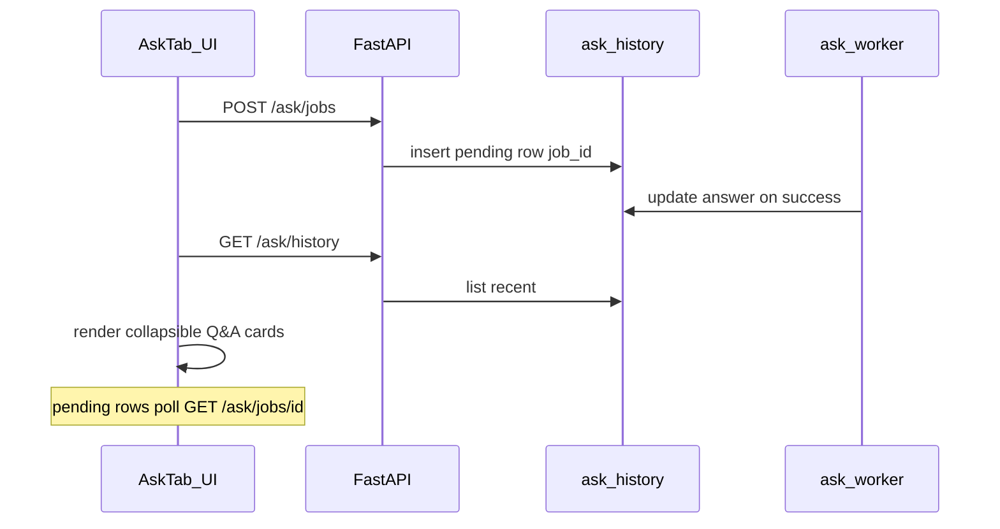

# Ask question history

## Problem

The Ask tab ([`static/index.html`](static/index.html)) only shows the **latest** answer in the DOM. Queued jobs live in an in-memory store ([`app/ask_queue.py`](app/ask_queue.py)) and are lost on server restart. There is no way to see past Ledgerly questions after reload or tab switch — despite the UI copy telling users they can leave and come back.

## Approach

Follow the existing [`decision_history`](app/db.py) pattern: new DB table, insert/list helpers in [`app/db.py`](app/db.py) + [`app/db_postgres.py`](app/db_postgres.py), `GET /ask/history` endpoint, and a bottom-of-page UI that reuses `renderAnswerBlocks()`.

Because background queue is the main "leave and return" path, persist **at enqueue** (status `pending`) and **update on completion** (status `complete` / `failed`). Stream/sync paths insert once on success.



**Scope (per your choice):** Ask Ledgerly only — not General advice (OpenAI).

---

## 1. Database schema

New migration [`supabase/migrations/20250617120000_ask_history.sql`](supabase/migrations/20250617120000_ask_history.sql):

```sql
CREATE TABLE IF NOT EXISTS ask_history (
    id TEXT PRIMARY KEY,
    job_id TEXT,
    asked_at BIGINT NOT NULL,
    status TEXT NOT NULL,          -- pending | complete | failed
    question TEXT NOT NULL,
    answer TEXT,
    tables_json TEXT,
    charts_json TEXT,
    route TEXT,
    doc_filter TEXT,
    error TEXT
);
CREATE INDEX IF NOT EXISTS idx_ask_history_asked_at ON ask_history(asked_at DESC);
```

Mirror the same `CREATE TABLE` in [`app/db.py`](app/db.py) `init_schema()` and [`app/db_postgres.py`](app/db_postgres.py) bootstrap SQL.

Add helpers (parallel to `insert_decision_history` / `list_decision_history`):

- `insert_ask_history_pending(conn, id, job_id, asked_at, question, doc_filter)`
- `update_ask_history_result(conn, job_id, *, status, answer, tables_json, charts_json, route, error)`
- `list_ask_history(conn, limit=50)` → rows ordered `asked_at DESC`

Use `json.dumps` for `tables_json` / `charts_json` (same shape as existing `AnswerTable` / `AnswerChart` dumps).

Optional retention: cap at ~100 rows on insert (delete oldest beyond limit) to keep SQLite lean.

---

## 2. API model and endpoint

In [`app/models.py`](app/models.py):

```python
class AskHistoryItem(BaseModel):
    id: str
    job_id: str | None = None
    asked_at: int
    status: Literal["pending", "complete", "failed"]
    question: str
    answer: str | None = None
    tables: list[AnswerTable] = Field(default_factory=list)
    charts: list[AnswerChart] = Field(default_factory=list)
    route: str | None = None
    doc_filter: str | None = None
    error: str | None = None
```

In [`app/main.py`](app/main.py):

- `GET /ask/history?limit=50` — returns `list[AskHistoryItem]`, parses JSON columns server-side.

---

## 3. Persist on server (single helper)

Add `persist_ask_history(...)` in a small module (e.g. [`app/ask_history.py`](app/ask_history.py)) to avoid duplicating JSON serialization logic.

**Write points:**

| Path | When | Action |
|------|------|--------|
| `POST /ask/jobs` ([`main.py` ~1405](app/main.py)) | Enqueue | `insert_ask_history_pending` with `id=job.id`, `job_id=job.id`, question, doc filter |
| [`app/ask_worker.py`](app/ask_worker.py) `_run_one_ask` | Success (all 3 paths) | `update_ask_history_result(..., status=complete, answer, tables, charts, route)` |
| Same | Exception handler | `update_ask_history_result(..., status=failed, error=...)` |
| [`main.py`](app/main.py) `_stream_ask_full` | After direct answer / no-context / stream generator completes | `insert` complete row (no job_id) |
| `POST /ask` sync endpoint | On each successful return | `insert` complete row |

Pass `doc_filter` from `doc_id`, `tag`, or empty string for "all documents".

Do **not** persist failed stream/sync requests (client aborts mid-stream).

---

## 4. UI — bottom of Ask tab

All changes in [`static/index.html`](static/index.html).

### HTML (after the General advice `<details>`, still inside `#panel-ask`)

```html
<div class="ask-section-block" id="ask-history-section">
  <h3>Previous questions</h3>
  <p class="ask-section-intro">Your recent Ledgerly questions and answers are saved here.</p>
  <div id="ask-history-loading" class="message loading" hidden>Loading…</div>
  <p id="ask-history-empty" class="field-hint" hidden>No questions yet.</p>
  <div id="ask-history-list"></div>
</div>
```

### CSS

- `.ask-history-item` — bordered card, margin between items
- `<details class="ask-history-item">` — question as `<summary>` (truncated to ~2 lines), timestamp in muted text
- `.ask-history-item[open] summary` — slightly bolder
- Pending: summary suffix " — preparing…" + muted answer area with loading text
- Failed: error message in `.message.error`

Reuse existing `.answer-md`, `.ask-answer-extra`, `.ask-subheading` inside each item's answer body.

### JS

New functions alongside existing ask handlers:

- `loadAskHistory()` — `GET /ask/history`, clear/rebuild `#ask-history-list`
- `renderAskHistoryItem(item)` — build `<details>` per row; for `complete` items call `renderAnswerBlocks(mdEl, extraEl, item.answer, {tables, charts}, [])`
- `refreshAskHistory()` — called from `setTab('ask')` (line ~1809) and after successful `submitAskStream` / `pollAskJob`
- `pollPendingAskHistory()` — for items with `status === 'pending' && job_id`, poll `GET /ask/jobs/{id}` every 5s (reuse existing poll interval); on success/failure re-fetch history or patch that card in place

Wire `loadAskHistory()` into `setTab` when `name === 'ask'`.

---

## 5. Tests

Add [`tests/test_ask_history.py`](tests/test_ask_history.py):

- Insert pending → update complete → list returns parsed tables/charts
- Failed job update sets status/error
- `GET /ask/history` via TestClient returns expected JSON shape

---

## Files touched

| File | Change |
|------|--------|
| `supabase/migrations/20250617120000_ask_history.sql` | New table |
| `app/db.py`, `app/db_postgres.py` | Schema + CRUD |
| `app/ask_history.py` | Persist helper (new) |
| `app/models.py` | `AskHistoryItem` |
| `app/main.py` | `GET /ask/history`, write hooks in ask/jobs/stream/sync |
| `app/ask_worker.py` | Update history on job complete/fail |
| `static/index.html` | History section HTML/CSS/JS |
| `tests/test_ask_history.py` | Unit/API tests |

---

## UX notes

- Newest questions first; each row collapsed by default so the list stays scannable.
- The live "Answer" block above remains for the in-progress question; history below is the durable record.
- Tables and charts in history use the same renderer as the live answer (including Chart.js init per card — destroy chart instances when re-rendering a card to avoid leaks).
