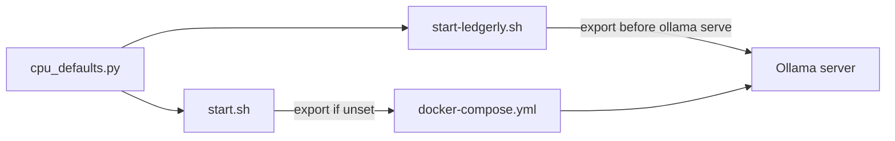

# Auto-detect CPU cores for OLLAMA_NUM_THREADS

## Context

Today [`docker-compose.yml`](docker-compose.yml) hardcodes a fallback of **4** threads:

```yaml
- OLLAMA_NUM_THREADS=${OLLAMA_NUM_THREADS:-4}
```

That value is read by the **Ollama server** (llama.cpp thread pool), not the FastAPI app. The app never touches it — so detection must happen **before** Ollama starts (shell scripts), with an explicit `.env` override always winning.

You chose: **OLLAMA_NUM_THREADS only**, **conservative** formula (~half cores, headroom, cap 8).

## Proposed default formula

Add a small, testable helper in [`app/cpu_defaults.py`](app/cpu_defaults.py) (new file):

```python
def available_cpu_count() -> int:
    # Prefer cgroup-aware count on Linux (Docker / WSL)
    try:
        return len(os.sched_getaffinity(0))
    except (AttributeError, OSError):
        return os.cpu_count() or 1

def default_ollama_num_threads() -> int:
    cpus = available_cpu_count()
    if cpus <= 2:
        return 1
    return max(1, min(cpus // 2, cpus - 1, 8))
```

| Logical cores | Auto threads |
|---------------|--------------|
| 1–2           | 1            |
| 4             | 2            |
| 8             | 4            |
| 16            | 8 (cap)      |

**Override rule:** if `OLLAMA_NUM_THREADS` is already set in the environment or `.env`, do not change it.

## Where to wire it



### 1. Shared Python helper + CLI

- New [`app/cpu_defaults.py`](app/cpu_defaults.py) with `available_cpu_count()` and `default_ollama_num_threads()`.
- Add `if __name__ == "__main__"` (or `python -m app.cpu_defaults`) so shell scripts can run:

  ```bash
  python3 -c "from app.cpu_defaults import default_ollama_num_threads; print(default_ollama_num_threads())"
  ```

  without importing the full app stack.

### 2. Docker path — [`start.sh`](start.sh)

Before `docker compose up -d`:

```bash
if [ -z "${OLLAMA_NUM_THREADS:-}" ]; then
  export OLLAMA_NUM_THREADS="$(python3 -c 'from app.cpu_defaults import default_ollama_num_threads; print(default_ollama_num_threads())')"
  echo "OLLAMA_NUM_THREADS=${OLLAMA_NUM_THREADS} (auto-detected, conservative)"
fi
```

Keep [`docker-compose.yml`](docker-compose.yml) fallback `:-4` as a safety net when someone runs `docker compose up` directly (document that `start.sh` is preferred).

### 3. Native path — [`start-ledgerly.sh`](start-ledgerly.sh)

Export the same value **before** `ollama serve` (and before the “Ollama already running” early-exit path when we start it ourselves). If Ollama was started externally without the var, log a one-line hint that a restart may be needed for thread changes.

### 4. Docs

Update [`.env.example`](.env.example) comment for `OLLAMA_NUM_THREADS`:

- When unset, `start.sh` / `start-ledgerly.sh` auto-set from core count (conservative).
- Manual override example: `OLLAMA_NUM_THREADS=4`.

One sentence in [`setup_and_testing.md`](setup_and_testing.md) under Docker / native startup.

### 5. Tests

New [`tests/test_cpu_defaults.py`](tests/test_cpu_defaults.py):

- Monkeypatch `available_cpu_count` (or `os.cpu_count` / `sched_getaffinity`) and assert outputs for 1, 2, 4, 8, 16 cores.
- No changes to [`app/config.py`](app/config.py) — out of scope per your choice.

## Out of scope (explicit)

- `OLLAMA_MAX_CONCURRENT` — stays profile-based (`1` portable / `2` default) in [`app/config.py`](app/config.py).
- Changing ingest/ask worker concurrency (already single-threaded by design).
- Auto-writing `.env` on first run.

## Verification

1. `pytest tests/test_cpu_defaults.py`
2. Unset `OLLAMA_NUM_THREADS`, run `./start.sh`, confirm printed auto value and `docker compose exec ollama printenv OLLAMA_NUM_THREADS` matches.
3. Set `OLLAMA_NUM_THREADS=6` in `.env`, confirm auto-detection is skipped.
