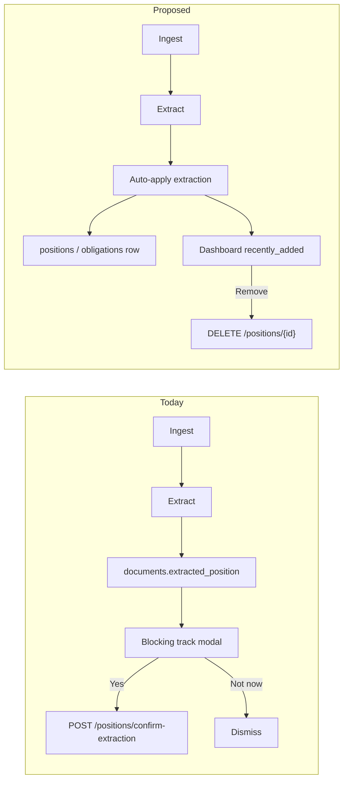

# Auto-track on ingest with Recently Added undo

## Problem

After ingest, if structured extraction finds a maturity/due date, the app stores a **pending** suggestion on the document and blocks the user with [`#track-modal`](static/index.html) ("Track this CD?" / "Track this bill?"). If the user walks away, nothing gets tracked until they return and confirm.

Prior plans explicitly avoided auto-confirm; this change reverses that in favor of **default yes + easy undo**.



## Approach

### 1. Backend: auto-apply extraction at end of ingest

**Where:** [`app/main.py`](app/main.py) inside `_ingest_text_core` (after structured extraction, before `conn.commit()`).

**What:** When extraction succeeds and has a required date (`maturity_date` for positions, `due_date` for obligations), automatically create the row using the same logic as today’s confirm endpoints.

**How (refactor, no duplication):**

- Extract shared helpers from `confirm_extraction` / `confirm_obligation_extraction`:
  - `apply_position_extraction(conn, document_id, extracted: ExtractedPosition | None = None, overrides=None) -> PositionResponse | None`
  - `apply_obligation_extraction(conn, document_id, extracted: ExtractedObligation | None = None, overrides=None) -> ObligationResponse | None`
- Keep existing `POST /positions/confirm-extraction` and `POST /obligations/confirm-extraction` as thin wrappers (still needed for legacy pending items and manual re-confirm).
- Call helpers from `_ingest_text_core` when auto-track is enabled.

**Config** in [`app/config.py`](app/config.py):

```python
INGEST_AUTO_TRACK_ENABLED = os.getenv("INGEST_AUTO_TRACK_ENABLED", "true").strip().lower() in ("true", "1", "yes")
RECENT_TRACK_DAYS = int(os.getenv("RECENT_TRACK_DAYS", "7"))  # window for Home "Recently added"
RECENT_TRACK_LIMIT = int(os.getenv("RECENT_TRACK_LIMIT", "10"))
```

**Behavior details:**

- Idempotent: if position/obligation already linked to `document_id`, skip (same as confirm endpoint today).
- On success: clear `extracted_position` / `extracted_obligation` on the document (same as accept path).
- On failure (missing date, DB error): log warning, leave pending JSON in place so existing Home pending cards remain as fallback.
- Extend [`IngestResponse`](app/models.py) with optional `auto_tracked_position` / `auto_tracked_obligation` so the frontend can show a clear success line without inferring from raw extraction.

**Scope:** Both positions and obligations (per your choice).

Works for **sync ingest**, **background queue** ([`app/ingest_worker.py`](app/ingest_worker.py) — no frontend required), and users who close the tab.

### 2. Dashboard: "Recently added" list

**Where:** [`app/dashboard.py`](app/dashboard.py) + [`app/db.py`](app/db.py) / [`app/db_postgres.py`](app/db_postgres.py).

**New queries:**

- `list_recent_positions(conn, since_ts, limit)` — unresolved positions with `created_at >= since_ts`, ordered `created_at DESC`
- `list_recent_obligations(conn, since_ts, limit)` — same for obligations

**Dashboard payload** — add to [`DashboardResponse`](app/models.py):

```python
recently_added: list[RecentlyAddedItem]  # unified: kind, id, label, document_id, created_at
```

Build human-readable labels reusing existing format helpers on the frontend (`formatExtractionLine` / `formatObligationLine` patterns).

With auto-track enabled, `pending_extractions` / `pending_obligation_extractions` should usually be empty; keep them for failed auto-track fallback and any pre-migration pending docs.

### 3. Frontend: remove blocking modal, add undo list on Home

**File:** [`static/index.html`](static/index.html)

| Change | Detail |
|--------|--------|
| Stop opening track modal on ingest success | Remove `showTrackModal` calls in `handleIngestSuccess`, queue completion (`handleJobQueueComplete`), and `maybePromptPendingExtraction` when auto-track is active |
| Success copy | Append e.g. "Tracked: CD at First National · $50,000 · matures 2026-03-15" when `auto_tracked_*` present in ingest response |
| New Home block | `#home-recently-added` below status card: heading "Recently added", list with **Remove** button per row |
| Remove action | Reuse existing `deletePosition` / `deleteObligation` (Data tab already has these + `easyConfirm`) |
| Legacy pending UI | Keep `#home-pending-extractions` cards only when dashboard still returns pending items (auto-track failure / old data) |

**Optional lightweight notice (not blocking):** After ingest, show a dismissible inline success banner on Home instead of the modal — no timeout needed since backend already applied the default.

**Remove / simplify:**

- `#track-modal` can stay for legacy pending fallback, or be removed if pending cards are sufficient.
- `sessionStorage` key `ledgerly-track-prompted` becomes unnecessary for the happy path.

### 4. Tests

| File | Cases |
|------|-------|
| New `tests/test_auto_track_ingest.py` | Ingest with mocked extraction → position/obligation row created, pending JSON cleared |
| [`tests/test_confirm_extraction.py`](tests/test_confirm_extraction.py) | Still passes via shared helper |
| [`tests/test_dashboard.py`](tests/test_dashboard.py) | `recently_added` populated for recent rows, empty outside window |
| Config off | `INGEST_AUTO_TRACK_ENABLED=false` restores pending + manual confirm behavior |

### 5. Docs touch-up (minimal)

One paragraph in [`static/help.html`](static/help.html): ingest now tracks CDs and bills automatically; check **Recently added** on Home to remove mistakes.

## What we are NOT doing

- No frontend-only timeout (unreliable if tab closes; backend auto-track solves the walk-away case).
- No new DB migration — `created_at` on positions/obligations is sufficient for recency.
- No change to Data tab tables (they remain the full management view).

## Risk / mitigation

| Risk | Mitigation |
|------|------------|
| Wrong LLM extraction auto-tracked | Prominent Home undo list; delete is one confirm away |
| Duplicate account creation | Reuse existing `_find_or_create_account_for_extraction` institution matching |
| User wants old confirm flow | `INGEST_AUTO_TRACK_ENABLED=false` env toggle |
