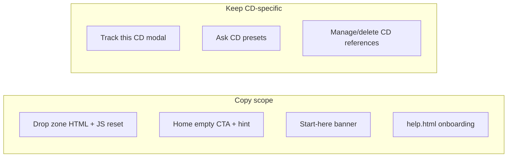

# Broaden document upload copy

## Goal

The Add document drop zone currently says **“Drop your CD letter here”**, which undersells supported uploads (PDF, JPG, PNG — statements, bills, letters, etc.). You chose **“Drop a statement or letter here”** and want related onboarding copy updated wherever it still implies CDs only.

## Files to change

Only user-facing static HTML — no backend or JS logic changes beyond resetting the drop-zone label string.

| File | What changes |
|------|----------------|
| [`static/index.html`](static/index.html) | Drop zone, Home empty state, start-here banner |
| [`static/help.html`](static/help.html) | Add document section + example workflow |

## Copy updates

### 1. Add document drop zone ([`static/index.html`](static/index.html))

**Two places must stay in sync** (initial HTML + busy-state reset in `setIngestDropZoneBusy`):

```906:907:static/index.html
            <strong>Drop your CD letter here</strong><br />
            <span class="field-hint">or click to browse — one file at a time works best</span>
```

```2691:2693:static/index.html
        } else if (!busy) {
          ingestDropZone.querySelector('strong').textContent = 'Drop your CD letter here';
        }
```

**New text:** `Drop a statement or letter here`

The intro line above already covers file types (“PDF, JPG, or PNG”) — no change needed there.

### 2. Home empty state ([`static/index.html`](static/index.html))

Current copy assumes a bank CD letter:

- Button: `Add a CD letter or statement` → **`Add a statement or letter`**
- Hint: `Drop a PDF from your bank. Ledgerly will find the maturity date.` → **`Drop a PDF or image. Ledgerly will find maturity and due dates when they're in the document.`**

### 3. Start-here banner ([`static/index.html`](static/index.html))

Current:

> To add a CD, go to **Add document**, drop your bank letter, then tap **Yes, track this**.

Proposed:

> To add a document, go to **Add document**, drop a statement or letter, then tap **Yes, track this** if Ledgerly finds a date to track.

(Keeps the maturity-tracking flow without implying every upload is a CD.)

### 4. Help page ([`static/help.html`](static/help.html))

| Location | Current | Proposed |
|----------|---------|----------|
| Add document intro (line ~128) | drop one CD letter or statement | drop a statement or letter |
| Example workflow step 2 (line ~152) | Drop a CD maturity letter | Drop a statement or letter |

Leave unchanged in help: glossary entries about CDs, Ask preset examples, “tracks CDs and bills it finds” (accurate product behavior), Manage/Delete copy that mentions CDs in context of tracked positions.

## What we are NOT changing

- **Track modal title** (`Track this CD?` / `Track this bill?`) — context-specific when extraction identifies asset type
- **Ask tab** CD presets and placeholders — still valid example questions
- **Data/Manage panels** — “CDs, money markets”, delete confirmations referencing tracked CDs/bills
- **Tests/docs** (`tests/`, `docs/`, `.cursor/plans/`) — internal/dev copy, not user UI

## Verification

Manual smoke check after edit:

1. Open **Add document** → drop zone shows **Drop a statement or letter here**
2. Upload a file → when ingest finishes, drop zone resets to the same text (not the old CD string)
3. Clear Home data / empty state → button + hint use new wording
4. Dismiss and re-show start-here banner (or clear `localStorage` key if persisted) → updated banner text
5. Open **help.html** → Add document + workflow steps match

No automated tests required — string-only UI copy change with no behavior impact.


