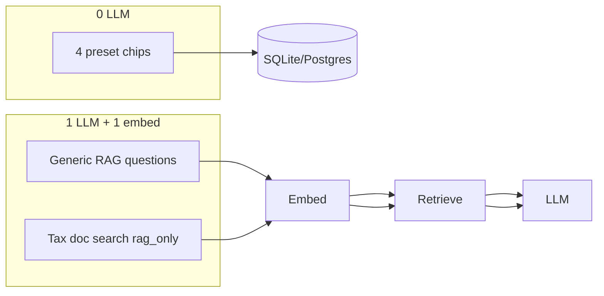

# CPU optimization audit: ingest and ask

**Short answer:** You have **not** optimized everything you can. The **Ask** path is in good shape after [`.cursor/plans/ask_cpu_load_reduction_9cf82fad.plan.md`](.cursor/plans/ask_cpu_load_reduction_9cf82fad.plan.md) (all todos marked completed). The **Ingest** path still has the largest remaining CPU cost, plus a few Ask gaps and one likely code bug.

---

## What is already optimized

### Ask (mostly complete)

| Optimization | Status | Where |
|---|---|---|
| Zero-LLM fast paths for 4 preset chips | Done | [`app/ask_fast_paths.py`](app/ask_fast_paths.py), [`app/ask_graph.py`](app/ask_graph.py) |
| Heuristic routing (no classifier/finance LLM) | Done | [`app/ask_graph.py`](app/ask_graph.py) |
| Finance tools LLM path disabled | Done | [`app/finance_tools_client.py`](app/finance_tools_client.py) |
| Global Ollama semaphore (shared with ingest) | Done | [`app/ollama_guard.py`](app/ollama_guard.py) |
| Portable profile: smaller model, inter-call sleep, concurrency=1 | Done | [`app/config.py`](app/config.py) |
| Background ask queue (one job at a time + inter-job sleep) | Done | [`app/ask_worker.py`](app/ask_worker.py), [`app/ask_queue.py`](app/ask_queue.py) |
| Rerank disabled by default | Done | `RERANK_ENABLED=false` |
| In-process embed cache | Done | [`app/embeddings_client.py`](app/embeddings_client.py) |
| Tab warmup (avoids cold-start latency; trades idle CPU for faster first request) | Done | [`app/ollama_warmup.py`](app/ollama_warmup.py) |
| Stream UX: phase NDJSON, spinner fix, 15m timeout | Done | [`app/main.py`](app/main.py), [`static/index.html`](static/index.html) |

**Current Ask LLM budget:**



### Ingest (partial)

| Optimization | Status | Where |
|---|---|---|
| Single-threaded ingest worker | Done | [`app/ingest_worker.py`](app/ingest_worker.py) |
| Inter-job sleep between queued jobs | Done | `INGEST_QUEUE_INTER_JOB_SLEEP_SEC=3` |
| Content-hash dedup (skip re-ingest) | Done | [`app/main.py`](app/main.py) `ingest_text` |
| Facts LLM pass off by default | Done | `INGEST_FACTS_ENABLED=false` |
| File size caps (PDF 20MB, image 10MB) | Done | [`app/ingest_worker.py`](app/ingest_worker.py) |
| Shared Ollama guard | Done | all embed/vision/chat paths |
| Block streaming Ask during ingest (portable only) | Partial | [`app/main.py`](app/main.py) `_check_ingest_busy` — **only on `/ask/stream`** |
| Batched embeddings | **Not wired** | `EMBED_BATCH_SIZE=32` in config, unused |
| OCR-first PDF path | **Not implemented** | [`app/pdf_ingest.py`](app/pdf_ingest.py) is pypdf text-only |
| Vault debounce | Config only | watcher module absent |

---

## Biggest remaining CPU costs

### 1. Ingest: one Ollama call per chunk (highest impact)

[`app/embeddings_client.py`](app/embeddings_client.py) loops sequentially:

```39:46:app/embeddings_client.py
async def embed_batch(texts: list[str], *, model: str | None = None) -> list[list[float]]:
    out: list[list[float]] = []
    for i, text in enumerate(texts):
        out.append(await embed_text(text, model=model))
        ...
```

A 50-page doc at 800-char chunks can mean **50+ full Ollama inferences**, each acquiring `ollama_guard`. Ollama's `/api/embed` accepts multiple strings in one request — `EMBED_BATCH_SIZE=32` is documented in [`.env.example`](.env.example) and [`setup_and_testing.md`](setup_and_testing.md) but never read.

Additionally, [`app/main.py`](app/main.py) calls `embedder.embed_many(..., on_embed_batch_complete=...)` but [`app/embeddings.py`](app/embeddings.py) only exposes `embed()` — no `embed_many`, no `dim`, no batch progress callback. This is both a **performance gap** and likely a **runtime bug** unless another code path is used in production.

### 2. Ingest: chunking API mismatch

[`app/chunking.py`](app/chunking.py) returns `list[str]`, but [`app/main.py`](app/main.py) expects objects with `.chunk_index`, `.content`, `.start_offset`, `.end_offset`. This suggests ingest may be broken or an alternate chunk helper exists elsewhere — either way, the intended offset-aware chunking is not wired.

### 3. Ask: unnecessary embed for structured questions

When route is `structured_data` and `use_rag=True` (default), Ask still embeds + retrieves even though layer2 DB summary may suffice:

```141:153:app/ask_graph.py
    if ask_request.use_rag and route in ("rag", "rag_only", "structured_data"):
        ...
        query_vec = await embeddings_client.embed_text(question)
        top_chunks = await retrieve_top_k(...)
```

Questions like "summarize my bills" pay for an extra Ollama embed call that may add no value.

### 4. SQLite retrieval: O(n) over all embeddings

On SQLite (default local setup), [`app/retrieval.py`](app/retrieval.py) loads every embedding row and scores in Python. This grows with corpus size and adds CPU on every non-fast-path Ask. Postgres path uses pgvector HNSW and is fine.

### 5. Ingest + Ask overlap not fully gated

`_check_ingest_busy` runs only on `/ask/stream` (line 1372). Sync `/ask`, `/ask/jobs`, and `/ask/image` can still queue Ollama work while ingest is embedding — they serialize via `ollama_guard` but the machine still runs back-to-back heavy inferences.

### 6. PDF/image ingest paths

- **PDF:** [`app/pdf_ingest.py`](app/pdf_ingest.py) ignores `PdfTextMode` and has no OCR/vision fallback despite `PDF_OCR_*` / `PDF_VISION_*` config. Scanned PDFs either fail or trigger expensive workarounds elsewhere.
- **Images:** full vision LLM via `LLAVA_MODEL` — inherently CPU-heavy; only mitigated by model choice and guard.

### 7. Warmup is a deliberate CPU tradeoff

Tab warmup preloads models (`num_predict: 1` chat + embed). This **reduces latency** but **uses cycles when switching tabs**. For minimum idle CPU, users can set `OLLAMA_WARMUP_ENABLED=false`.

### 8. Minor incomplete plan items

From the Ask CPU plan (marked complete but with noted gaps):

- **Past questions hook** for async ask jobs (C3) — not implemented
- **`OLLAMA_NUM_THREADS` docs** in `.env.example` — not added
- **Ingest-busy guard on all Ask endpoints** (B3) — only partial

---

## What "fully optimized" would look like

Minimum cycles to accomplish ingest/answer, in priority order:

### Tier 1 — Must-do for ingest CPU (biggest win)

1. **Wire true batched embed** in [`app/embeddings_client.py`](app/embeddings_client.py): send up to `EMBED_BATCH_SIZE` strings per `/api/embed` call; restore `HttpEmbedder.embed_many` + `dim` in [`app/embeddings.py`](app/embeddings.py) with progress callbacks for the worker ETA.
2. **Fix chunking** to return proper chunk objects (or adapt `ingest_text` to strings).
3. **Verify end-to-end** with a multi-chunk doc and confirm embed call count drops from N to ceil(N/32).

### Tier 2 — Ask edge-case savings

4. **Skip RAG embed/retrieve** when route is `structured_data` and layer2 is non-empty (unless user explicitly scopes to documents via `doc_id`/`tag`).
5. **Extend `_check_ingest_busy`** to `/ask`, `/ask/jobs`, and optionally auto-queue instead of 503 on portable.
6. **Add 5th preset fast path** for "find tax documents (1099)" if that chip is still in the UI — currently uses `rag_only` (1 embed + 1 LLM).

### Tier 3 — Scale and PDF paths

7. **SQLite retrieval index** — at minimum cap/lazy-load; ideally sqlite-vec or migrate local dev to Postgres for vector index.
8. **Implement PDF OCR-first** per config (`PDF_OCR_ENABLED`, page thresholds) before falling back to per-page vision.
9. **Optional:** larger chunks / adaptive chunk size for ingest to reduce embed count on long docs.

### Tier 4 — Operational tuning (no code)

Users on low-spec machines can set today:

```env
LEDGERLY_PROFILE=portable
LLM_MODEL=qwen2.5:3b
OLLAMA_MAX_CONCURRENT=1
LLM_INTER_CALL_SLEEP_SEC=2
INGEST_QUEUE_INTER_JOB_SLEEP_SEC=5
ASK_QUEUE_INTER_JOB_SLEEP_SEC=5
RERANK_ENABLED=false
FINANCE_TOOLS_BASE_URL=
OLLAMA_WARMUP_ENABLED=false   # if idle CPU matters more than first-request latency
OLLAMA_NUM_THREADS=4          # cap Ollama thread pool (Ollama env, not app)
```

Use **queued Ask mode** (default on portable) instead of stream.

---

## Bottom line

| Path | Optimized enough? | Main gap |
|---|---|---|
| **Ask — preset questions** | Yes | 0 LLM, 0 embed |
| **Ask — generic RAG** | Mostly | 1 embed + 1 LLM is near minimum; structured route over-fetches; SQLite O(n) retrieval |
| **Ingest — text** | No | N sequential embeds; batching documented but not implemented |
| **Ingest — PDF/image** | No | OCR/vision strategy not built; image = full vision LLM |
| **Cross-cutting** | Mostly | Ollama guard + queues good; ingest/ask overlap guard incomplete |

**You are not at the floor yet.** The single highest-impact change is **batched ingest embeddings** — it could cut ingest Ollama invocations by up to ~32x with no change to answer quality. Ask is already close to the theoretical minimum (1 embed + 1 LLM) for open-ended document questions.
