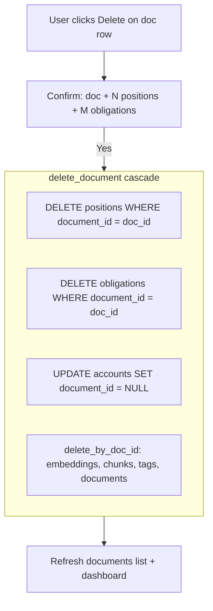

# Document delete with cascade

## Answer to your question

**Yes — when a user deletes a document, we should also delete maturities and obligations that were linked to it.** You chose this approach, and it fits the product: deleting a doc means “undo this upload,” not just hide it from Ask.

This is **not** overly complicated. The DB already has `delete_by_doc_id` for chunks/embeddings; positions/obligations link via loose `document_id` text columns (no FK), so we add a few explicit deletes before removing the document row.

**Accounts are kept.** Auto-track may create/link an account (e.g. “First National Bank”), but we only clear `accounts.document_id` — we do not delete the account. If it has no remaining positions, the user can remove it from Data → Accounts if they want.



## What gets deleted vs kept

| Data | On doc delete |
|------|----------------|
| Document row, chunks, embeddings, tags | Deleted |
| Positions with `document_id = doc_id` | **Deleted** (removes Home maturities from that doc) |
| Obligations with `document_id = doc_id` | **Deleted** |
| Pending `extracted_position` / `extracted_obligation` on doc | Deleted with document row |
| Accounts | **Kept**; `document_id` link cleared |
| Positions/obligations manually added with no `document_id` | Unaffected |
| Vault original file (if any) | **Out of scope** — vault is optional/stub; no file delete in v1 |

After delete, re-uploading the same PDF works without duplicate-content blocking (content hash row is gone).

## Backend (~60 lines)

### 1. Extend DB layer

**Files:** [`app/db.py`](app/db.py), [`app/db_postgres.py`](app/db_postgres.py)

Add helpers:

```python
def delete_positions_by_document_id(conn, doc_id: str) -> int
def delete_obligations_by_document_id(conn, doc_id: str) -> int
def clear_accounts_linked_to_document(conn, doc_id: str) -> None
```

Add orchestrator:

```python
def delete_document_cascade(conn, doc_id: str) -> dict[str, int]:
    # returns counts: positions_deleted, obligations_deleted
    # order: positions → obligations → clear account links → delete_by_doc_id
```

**Fix:** [`delete_by_doc_id`](app/db_postgres.py) currently calls `conn.commit()` internally. New cascade function should use a **single transaction** with caller committing (match other routes). Refactor `delete_by_doc_id` to stop auto-committing when called from cascade (or inline the deletes in `delete_document_cascade` and leave ingest rollback path unchanged).

### 2. API endpoint

**File:** [`app/main.py`](app/main.py)

```python
@app.delete("/documents/{doc_id}", status_code=204)
def delete_document_route(request: Request, doc_id: str):
    # 404 if not doc_exist
    # delete_document_cascade(conn, doc_id)
    # conn.commit()
```

Optional: return JSON with counts instead of 204 if useful for UI toast — 204 is fine to match existing position delete.

### 3. Response model (optional)

If we want the confirm dialog to show counts **before** delete, add:

```python
GET /documents/{doc_id}/delete-preview
→ { positions_count, obligations_count, title }
```

**Recommendation:** skip preview endpoint; build confirm message from list row data (positions/obligations counts require extra query). Simpler v1: generic confirm — *“Delete this document? Any CD or bill tracked from it will also be removed.”*

## Frontend (~25 lines)

**File:** [`static/index.html`](static/index.html)

In `renderDocumentsList`, next to **Edit**, add **Delete** button per row:

- Reuse existing [`easyConfirm`](static/index.html) modal (same as position delete)
- Message: `Delete "position1.pdf"? This removes it from Ask and deletes any CD or bill tracked from this document.`
- `DELETE /documents/{doc_id}`
- On success: refresh documents list, `loadDashboard()`, `refreshDocsSelect()` (Ask doc dropdown)

## Tests

**New file:** `tests/test_delete_document.py`

| Case | Assert |
|------|--------|
| Delete unknown doc | 404 |
| Ingest + auto-track CD, then delete doc | doc gone, position gone, dashboard empty |
| Doc with no linked position | doc gone, other positions untouched |
| Obligation linked to doc | obligation deleted |

Use sqlite `tmp_path` pattern from [`tests/test_dashboard.py`](tests/test_dashboard.py).

## Docs touch-up

One sentence in [`static/help.html`](static/help.html) and [`setup_and_testing.md`](setup_and_testing.md): Documents tab → Delete removes the document and any tracked CD/bill from that upload.

## Not in scope

- Deleting vault files on disk
- Deleting empty auto-created accounts automatically
- Bulk delete / select multiple docs

## Manual test

1. Upload [`test-files/position1.pdf`](test-files/position1.pdf) → Home shows maturity
2. More → Documents → Delete that row → confirm
3. Home shows no maturities; re-upload same file succeeds and tracks again
