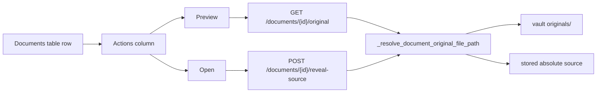

# Document list — view original files

## Current state

Manage → Documents already has **Preview** / **Open** helpers ([`appendDocumentOriginalActions`](static/index.html), [`openDocumentOriginalPreview`](static/index.html)) wired to existing endpoints:

- `GET /documents/{doc_id}/original` — stream PDF/image in a new tab
- `POST /documents/{doc_id}/reveal-source` — open in OS default app

Today those buttons are rendered only in the **Source** column (easy to miss in a 9-column table). The Actions column has only **Edit** and **Delete**.

```2250:2283:static/index.html
appendDocumentOriginalActions(tdSource, d.doc_id, d, { leadingSpace: true });
// ...
tdAct.appendChild(btnEdit);
tdAct.appendChild(btnDelete);
```

**Gap:** [`DocumentSummary`](app/models.py) (used by `GET /documents`) does not include `has_openable_original`, even though [`IngestResponse`](app/models.py) already does. The list UI therefore guesses availability from path metadata (`original_vault_path` / absolute `source`) and may show Preview when the file was moved, or hide it when only a vault-relative path exists without a resolvable absolute `source`.



## Implementation

### 1. Backend — accurate `has_openable_original` on list rows

**Files:** [`app/models.py`](app/models.py), [`app/main.py`](app/main.py)

- Add `has_openable_original: bool = False` to `DocumentSummary` (same semantics as on `IngestResponse`).
- In `_document_summary_from_row`, compute it with the existing helper:

```python
has_openable_original=_stored_original_file_exists(r[2], r[9] if len(r) > 9 else None),
```

No new routes; `GET /documents` and `PATCH /documents/{doc_id}` responses automatically gain the field.

### 2. Frontend — prominent View actions per row

**File:** [`static/index.html`](static/index.html)

In `renderDocumentsList`:

- Call `appendDocumentOriginalActions(tdAct, d.doc_id, d, { buttonClass: 'btn-small' })` **before** Edit/Delete so Preview/Open sit in the Actions column.
- **Remove** the duplicate call on `tdSource` (Source column stays path text only).
- Update `documentOriginalMayPreview` to treat `has_openable_original === true` as the primary signal (already partially there; ensure list rows use API value over heuristics).

Optional polish (low cost, same file):

- Add the same actions inside [`documents-edit-modal`](static/index.html) (e.g. a `#documents-edit-original-actions` div above Save/Cancel) so users can verify a path after editing Source.

### 3. Frontend — clearer failures

**File:** [`static/index.html`](static/index.html)

Improve `openDocumentOriginalPreview`:

- Before `window.open`, `fetch` the `/original` URL (or HEAD if supported).
- On **403**: alert that preview only works from `localhost` / `127.0.0.1` unless the server sets `ALLOW_LOCAL_FILE_REVEAL=true`.
- On **404**: alert that the file may have moved; suggest updating Source under Edit.

Keep `openDocumentSourceInOS` alert behavior as-is (already surfaces server detail).

### 4. Copy tweak

**File:** [`static/index.html`](static/index.html)

Update the Document review intro line (~1136) from “edit tags or linked account” to mention **Preview** / **Open** when a saved original or absolute path exists.

## When buttons appear

| Situation | Preview | Open |
|-----------|---------|------|
| Vault saved original exists on disk | Yes | Yes (absolute path in `source` or vault) |
| User pasted absolute path in Source | Yes, if file exists | Yes |
| Browser upload, vault disabled (filename only) | No | No — user must paste path in Edit |
| File moved/deleted after ingest | No (`has_openable_original: false`) | No |
| UI opened via LAN IP (not localhost) | Hidden or fails with 403 message | Same |

## Scope boundaries

- **In scope:** original file Preview/Open in the documents list (your choice)
- **Out of scope:** extracted-text viewer, inline iframe embed, changing vault storage, new file-serving endpoints

## Test plan

1. **Manual:** Manage → Documents → load list → row with vault PDF shows **Preview** + **Open** in Actions; Preview opens PDF in new tab.
2. **Manual:** Document with only a filename (no vault) → no Preview/Open; paste absolute path in Edit → buttons appear after reload.
3. **Manual:** Move/delete file on disk → reload list → buttons hidden (`has_openable_original: false`).
4. **Manual:** Open UI at non-localhost URL → Preview shows friendly 403 message.
5. **Optional unit test:** small test that `GET /documents` returns `has_openable_original` when a temp file + vault path are seeded (mirror ingest-response pattern in [`tests/test_delete_document.py`](tests/test_delete_document.py) fixtures).
