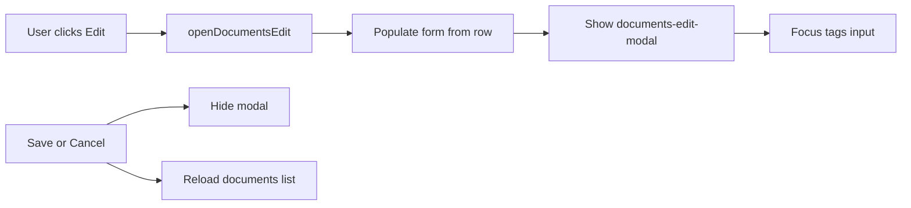

# Document edit modal

## Problem

In **Manage → Documents**, clicking **Edit** calls [`openDocumentsEdit`](static/index.html) which reveals `#documents-edit-form` at the **bottom of the section**, below the full documents table:

```1131:1153:static/index.html
<div id="documents-list" hidden>
  <table class="data-table documents-table">...</table>
</div>
<div id="documents-edit-form" class="data-form-inline" hidden>
  <h3 id="documents-edit-title">Edit document</h3>
  ...
</div>
```

There is no scroll, focus, or row highlight — on a long list the form opens off-screen and feels like nothing happened.

## Chosen approach: modal overlay

You chose a **modal** over scroll-to-bottom or a panel above the table. This fits well:

- Only 3 editable fields (tags, source path, linked account)
- Matches existing modal patterns (`renew-modal`, `track-modal`)
- No layout fight with the wide 9-column table
- Works on small screens without hunting below the fold



## Implementation (single file)

**File:** [`static/index.html`](static/index.html)

### 1. Add modal markup near other global modals

Place a new `#documents-edit-modal` next to `#renew-modal` (~line 1200), reusing existing classes:

- Outer: `track-modal-overlay` (fixed center, dimmed backdrop — already styled at lines 679–701)
- Inner: `track-modal-card`
- Move the current form fields from `#documents-edit-form` into this modal (same input IDs so JS changes stay small)

Structure (mirrors `renew-modal`):

```html
<div id="documents-edit-modal" class="track-modal-overlay" hidden role="dialog" aria-modal="true" aria-labelledby="documents-edit-title">
  <div class="track-modal-card">
    <h2 id="documents-edit-title">Edit document</h2>
    <div id="documents-edit-message" class="message" role="alert" hidden></div>
    <form id="form-documents-edit">…existing fields…</form>
    <!-- Save / Cancel stay inside the form as today -->
  </div>
</div>
```

Remove the old inline `#documents-edit-form` block from `#manage-section-documents`.

### 2. Small CSS tweak (optional, ~3 lines)

Add label spacing inside `.track-modal-card` if needed (renew-modal only has one field today). Example:

```css
.track-modal-card label { display: block; margin-top: 0.75rem; }
.track-modal-card label:first-of-type { margin-top: 0; }
```

Reuse `.home-confirm-btn` on Save/Cancel if you want button styling consistent with renew-modal; otherwise keep current submit/cancel buttons.

### 3. Update JS open/close helpers

In [`openDocumentsEdit`](static/index.html) (~line 2209):

- Replace `formWrap.hidden = false` with `documents-edit-modal.hidden = false`
- After show: `tagsInput.focus()` for immediate keyboard entry
- Add `hideDocumentsEditModal()` that sets `hidden = true` and clears `#documents-edit-message`

Wire cancel (~line 2247), successful save (~line 2281), and [`loadDocumentsList`](static/index.html) (~line 2051) to call `hideDocumentsEditModal()` instead of hiding the old inline form.

### 4. Optional polish (low cost, recommended)

- **Escape** closes the modal (listen on `keydown` while open; same handler as Cancel)
- **Backdrop click** closes on overlay click but not card click (standard dialog behavior)

Match whatever `renew-modal` does today for consistency; add Escape only if it is a one-liner in the same bind block.

### 5. No backend changes

PATCH `/documents/{doc_id}` and field semantics stay the same.

## What we are NOT doing

- No change to the Data tab inline form (accounts/positions/obligations) — same bottom-form issue exists there but out of scope unless you want the same modal treatment later
- No inline row expansion or table reordering
- No new tests (frontend-only UX; manual verify is enough)

## Manual test checklist

1. Manage → Documents → Load list → Edit on first row → modal appears centered with title `Edit: {doc title}`
2. Edit on last row in a long list → modal still appears immediately (no scroll needed)
3. Change tags / source / linked account → Save → modal closes, table refreshes with new values
4. Cancel and Escape (if added) → modal closes, no API call
5. Failed save → error shows inside modal, modal stays open
