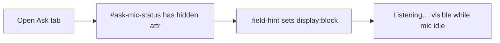

# Fix Ask tab showing "Listening…" without a click

## Diagnosis

You confirmed the symptom: gray **"Listening…"** text appears next to **"Speak question"** when opening Ask, without clicking.

That means JavaScript state is **idle** (`isListening = false`) but the status element is **visible**. The mic handler in [`static/index.html`](static/index.html) only calls `startListening()` from the mic button click — there is no auto-start on `setTab('ask')` or page load.

```3730:3755:static/index.html
function startListening() {
  if (statusEl) {
    statusEl.textContent = 'Listening…';
    statusEl.hidden = false;
  }
  micBtn.textContent = 'Stop listening';
  // ...
}
micBtn.addEventListener('click', function () {
  if (isListening) { stopListening('cancel'); return; }
  startListening();
});
```

**Root cause:** `#ask-mic-status` uses `class="field-hint"` and ships with `hidden` in HTML:

```1003:1004:static/index.html
<button type="button" id="btn-ask-mic">Speak question</button>
<span id="ask-mic-status" class="field-hint" hidden>Listening…</span>
```

But author CSS forces hints to display:

```309:309:static/index.html
.field-hint { display: block; font-size: var(--text-help); color: var(--text-muted); ... }
```

Author `display: block` wins over the browser default `[hidden]` rule, so the idle label is always shown. The project already uses targeted `[hidden] { display: none !important; }` for overlays (`#ingest-submit-wrap`, modals, etc.) but not for field hints.



## Fix (minimal, in [`static/index.html`](static/index.html))

### 1. Restore correct `hidden` behavior (primary fix)

Add a global safeguard near the top of the stylesheet (HTML spec recommendation):

```css
[hidden] { display: none !important; }
```

This fixes `#ask-mic-status` and any other toggled hints (`#ask-warmup-hint`, `#ask-queued-note`, etc.) in one place. No JS changes required for the reported bug.

### 2. Stop mic when leaving Ask via in-app tabs (secondary safety)

The existing visibility handler only runs when the **browser tab** is hidden — switching Home → Ask inside Ledgerly does **not** fire `visibilitychange`. If a user *did* click Speak and then switched panels, listening could continue in the background.

In `bindAskMic()`, expose a small hook and call it from `setTab()`:

- When `name !== 'ask'` and mic is active → `stopListening('tab-change')`
- When entering Ask while idle → ensure status stays hidden and button label is **"Speak question"**

Implementation sketch (keep scope tiny):

```javascript
// end of bindAskMic IIFE
window._ledgerlyStopAskMic = function (reason) {
  if (isListening) stopListening(reason || 'tab-change');
  else if (statusEl) statusEl.hidden = true;
};

// in setTab(), after panel toggle
if (name !== 'ask' && typeof window._ledgerlyStopAskMic === 'function') {
  window._ledgerlyStopAskMic('tab-change');
}
```

Optional polish: on `tab-change` stop, use the existing idle copy ("Stopped listening — tap Speak again when ready.") only if the user had actually been listening; otherwise stay silent.

## What we are not changing

- Click-to-speak flow and auto-submit on result (unchanged)
- 45s hard cap and browser-tab visibility stop from the recent mic idle safety work (unchanged)
- Ollama warmup on Ask tab open (shows different text: "Getting AI ready…")

## Test plan

Manual checks in Chrome (your primary browser):

1. Open Ask tab fresh → **no** "Listening…" text; button reads **"Speak question"**
2. Click Speak → "Listening…" appears; button reads **"Stop listening"**
3. Say a question → auto-submit; status hides again
4. Click Speak → switch to Home tab → return to Ask → mic is idle, no stuck listening state
5. Spot-check `#ask-warmup-hint` still only appears during warmup (not always visible)

No new pytest coverage (browser-only UI/CSS).
