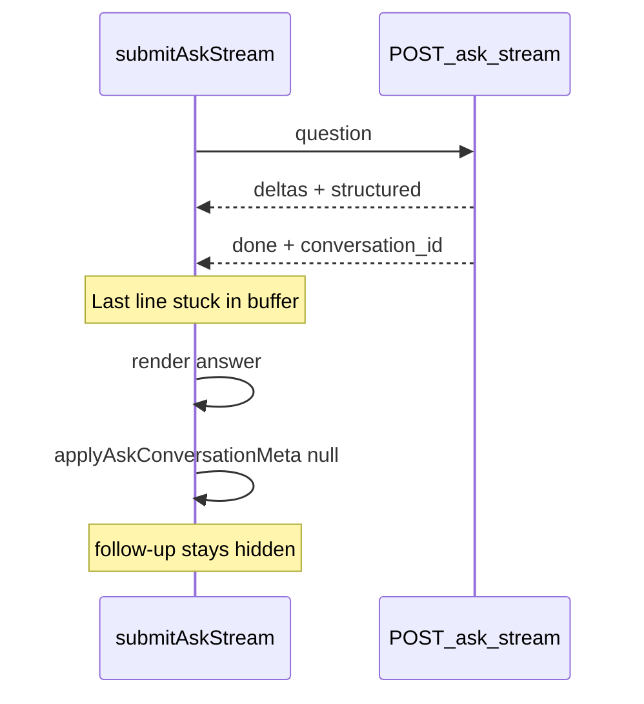
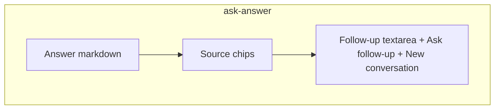

# Fix follow-up question field under the answer

## Problem

You see **New conversation** but not a place to type the next question. That matches the current UI behavior:

- [`#btn-ask-new-conversation`](static/index.html) is **always visible** (no `hidden` attribute).
- [`#ask-followup-block`](static/index.html) starts `hidden` and only appears when `activeConversationId` is set via `showAskFollowupBlock()`.

```3984:3987:static/index.html
      function showAskFollowupBlock() {
        var block = document.getElementById('ask-followup-block');
        if (block) block.hidden = !activeConversationId;
      }
```

So the follow-up field is implemented, but **`conversation_id` is not reliably reaching the browser** after an answer — especially in the default **stream** mode.

## Root cause (stream mode)

In [`submitAskStream()`](static/index.html), the NDJSON reader exits on `reader.read()` returning `done: true` **without flushing the final line left in `buffer`**. The backend emits `conversation_id` on the last line:

```1433:1440:app/main.py
        tail = _ask_meta_payload(
            conversation_id=turn_result.conversation_id,
            turn_id=turn_result.turn_id,
            related_documents=related_documents,
        )
        payload: dict[str, Any] = {"done": True}
        payload.update(tail)
        yield json.dumps(payload) + "\n"
```

The answer still renders from earlier `delta` / `structured` lines, but the final metadata line can be dropped → `streamMeta` stays null → follow-up block never unhides.



Queued mode is less affected (`job.conversation_id` is set at enqueue in [`ask_jobs_enqueue`](app/main.py)), but stream is the default on non-portable profiles.

## Target UX

After any successful Ledgerly answer:

1. Answer text and sources show in the Answer card.
2. **Directly below the answer**, a follow-up textarea + **Ask follow-up** button appear.
3. **New conversation** appears only when a conversation is active (not orphaned above an empty follow-up area).



## Implementation (single file focus: [`static/index.html`](static/index.html))

### 1. Fix stream buffer flush

In `submitAskStream()`, refactor the read loop to:

- Process `value` even on the terminal read.
- After the loop, parse any remaining non-empty `buffer` as one final NDJSON line.

Extract a small helper like `processAskStreamLine(obj)` so meta parsing is not duplicated.

### 2. Harden conversation meta after success

In `applyAskConversationMeta(meta)` / post-answer path:

- If `meta.conversation_id` is missing after a successful answer, **fallback**: read the newest complete item from the already-fetched history (or `GET /ask/history?limit=1`) and adopt its `conversation_id`.
- Call `showAskFollowupBlock()` whenever the answer block is shown after success, not only when meta is perfect.

Also hide the follow-up block when a new ask starts (`submitAskStream` / `submitAskQueued` at the top), so it does not linger while loading.

### 3. Move follow-up inside the Answer card

Restructure HTML so `#ask-followup-block` is a **child of `#ask-answer`**, placed after `#ask-sources`:

```html
<div id="ask-answer" class="ask-general-answer-wrap" hidden>
  <span class="ask-subheading">Answer</span>
  <div id="ask-answer-md" class="answer-md"></div>
  <div id="ask-answer-extra" class="ask-answer-extra"></div>
  <div id="ask-sources" class="ask-sources" hidden></div>
  <div id="ask-followup-block" class="ask-followup-block" hidden>
    ...
  </div>
</div>
```

Remove the standalone `.ask-conversation-actions` wrapper above General advice, and move **New conversation** into `.ask-followup-actions` beside **Ask follow-up**. Hide that button until `activeConversationId` is set (same condition as the follow-up block).

### 4. CSS tweaks

In existing `.ask-followup-block` rules:

- Keep the top border (now separates follow-up from sources inside the card).
- Remove duplicate outer margin if the parent `.ask-general-answer-wrap` already provides spacing.
- Ensure textarea is visibly sized (`min-height: 72px` already exists).

### 5. Optional test coverage

Add a lightweight test in [`tests/test_ask_conversation.py`](tests/test_ask_conversation.py) asserting stream final payload includes `conversation_id` (backend already correct). Frontend buffer fix is manual-verify only unless you add a JS test harness later.

## Manual verification

1. Ask a preset question (stream mode): answer appears → follow-up textarea visible **inside** the Answer section.
2. Type a follow-up → new answer replaces the main answer; history shows nested thread.
3. **New conversation** clears answer + follow-up; button hides until next answer.
4. Repeat in **queued/background** mode if enabled on your device.
5. Click **Continue this conversation** in history → answer restores and follow-up field appears + focuses.

## Out of scope

- Follow-up for **General advice (OpenAI)** — intentionally single-turn per existing plan.
- Inline follow-up inside collapsed **Previous questions** rows (resume button already covers this).
