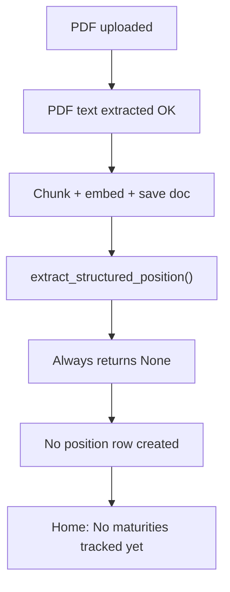

# Fix missing maturities after ingest

## Diagnosis

Your upload **did ingest successfully** — the document was chunked, embedded, and saved. What failed is the **next step**: turning document text into a tracked position.

The pipeline in [`app/main.py`](app/main.py) is wired correctly:

```586:617:app/main.py
    if INGEST_STRUCTURED_ENABLED:
        ...
            extracted_dict = await extract_structured_position(normalized, title)
            if extracted_dict and extracted_dict.get("maturity_date"):
                set_document_extracted_position(conn, doc_id, json.dumps(extracted_dict))
        ...
    if INGEST_AUTO_TRACK_ENABLED:
        if extracted_for_response is not None:
            auto_tracked_position = apply_position_extraction(...)
```

But the extractor itself is a no-op stub in [`app/ingest_structured.py`](app/ingest_structured.py):

```18:23:app/ingest_structured.py
async def extract_structured_position(text: str, title: str | None = None) -> dict[str, Any] | None:
    return None

async def extract_structured_obligation(text: str, title: str | None = None) -> dict[str, Any] | None:
    return None
```

So every upload — including `position1.pdf` — follows this path:



This is **not** a PDF/OCR problem and **not** a frontend bug. Auto-track ([`app/extraction_apply.py`](app/extraction_apply.py)) and Home dashboard ([`app/dashboard.py`](app/dashboard.py)) are implemented and tested — they just never receive extraction data. Tests in [`tests/test_auto_track_ingest.py`](tests/test_auto_track_ingest.py) mock the extractor; production code hits the stub.

`position1.pdf` is not in the repo (likely created locally in a prior session). The sample CD letter content lives in [`docs/sample-cd-maturity-letter.md`](docs/sample-cd-maturity-letter.md) and is the right basis for a test file.

## Fix: implement structured extraction

### 1. Implement LLM extraction in [`app/ingest_structured.py`](app/ingest_structured.py)

Add real implementations for both functions using the existing local Ollama client ([`app/llm_client.py`](app/llm_client.py) → `answer_with_context`):

- **Input:** first ~14k chars of document text + optional title (reuse `INGEST_FACTS_MAX_CHARS` from [`app/config.py`](app/config.py), or add `INGEST_STRUCTURED_MAX_CHARS` with same default).
- **Prompt:** ask the model to return **only JSON** matching [`ExtractedPosition`](app/models.py) / [`ExtractedObligation`](app/models.py) fields.
- **Parse:** strip markdown fences if present; `json.loads`; validate with Pydantic models.
- **Normalize dates:** convert any parsed date to `YYYY-MM-DD` (required by dashboard/triggers).
- **Return `None`** when no `maturity_date` / `due_date` — same contract as today.
- **Errors:** log and return `None` (ingest must not fail because extraction failed).

Suggested position JSON schema for the prompt:

```json
{
  "institution": "First National Bank",
  "asset_type": "CD",
  "description": "6-month CD",
  "principal": 10000,
  "rate_apr": 4.5,
  "maturity_date": "2026-09-15",
  "confidence": "high"
}
```

Keep `detect_tax_document_tags()` unchanged.

### 2. Add a lightweight regex pre-pass (optional but recommended)

Before calling the LLM, scan for obvious patterns like `Maturity date`, `matures on`, `due date` with a date nearby. If found, either:
- return a low-confidence extraction immediately (fast path for test PDFs), or
- skip LLM when high-confidence regex match exists.

This makes [`docs/sample-cd-maturity-letter.md`](docs/sample-cd-maturity-letter.md)-style docs reliable even if Ollama is slow/busy.

### 3. Add unit tests in `tests/test_ingest_structured.py`

| Test | What it verifies |
|------|------------------|
| Parses fenced JSON from LLM response | JSON extraction helper |
| Normalizes `March 30, 2026` → `2026-03-30` | Date helper |
| `extract_structured_position` with mocked LLM | Returns dict with maturity_date |
| Sample CD letter text (no LLM) | Regex fast path finds maturity |
| Obligation bill text | Returns dict with due_date |

Existing [`tests/test_auto_track_ingest.py`](tests/test_auto_track_ingest.py) should continue to pass unchanged.

### 4. Recreate a test PDF

Add [`test-files/position1.pdf`](test-files/position1.pdf) generated from the sample CD letter with a **future** maturity date (today is 2026-06-14, so use e.g. `2026-09-15` so Home shows it under upcoming maturities, not only overdue).

### 5. Fix your already-uploaded document

There is no re-extract endpoint today. After the fix is deployed:

1. Open **Documents** drawer → delete the existing `position1.pdf` entry (or note its doc id).
2. Re-upload `position1.pdf`.
3. Confirm Home shows the CD under **Recently added** / **Next maturity**.

**Workaround now (without waiting for the fix):** Data → Positions → Add position manually with maturity date, linked to the ingested document.

If re-upload hits duplicate-content error, either delete the old doc first or set a new custom doc id before uploading.

## Expected behavior after fix

| Step | Result |
|------|--------|
| Upload CD PDF | Ingest succeeds |
| Extraction | Finds maturity_date |
| Auto-track | Creates position + account |
| Home | Shows maturity in Recently added / Next maturity |
| Add document message | Either redirects Home with "Tracked: CD at …" or stays with tracked line |

## Files to change

- [`app/ingest_structured.py`](app/ingest_structured.py) — main fix
- [`app/config.py`](app/config.py) — optional `INGEST_STRUCTURED_MAX_CHARS`
- `tests/test_ingest_structured.py` — new tests
- [`test-files/position1.pdf`](test-files/position1.pdf) — test fixture
- [`.env.example`](.env.example) — document new env var if added

No changes needed to [`static/index.html`](static/index.html), [`app/extraction_apply.py`](app/extraction_apply.py), or dashboard logic — they already handle the happy path.

## Out of scope (unless you want them)

- Re-extract endpoint for already-ingested docs without re-upload
- Implementing [`app/ingest_facts.py`](app/ingest_facts.py) stub (separate feature, disabled by default)
