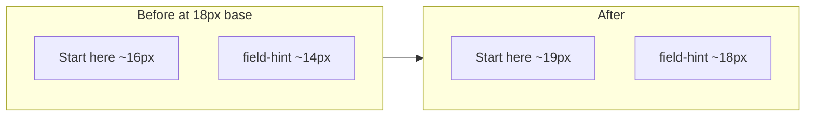

# Increase instructional / help font sizes

## Problem

The main app uses `body.easy-ui { font-size: 18px }` as its base, but help and onboarding text overrides that with smaller `rem` values. On an 18px base, the copy you quoted renders at roughly **16px** (Start here banner, How to use link) while field hints are even smaller at **~14px**.

Relevant markup today:

```793:796:static/index.html
<section id="start-here-banner" class="start-here-banner" hidden>
  <button type="button" class="start-here-dismiss" ...>×</button>
  <p><strong>Start here:</strong> Open <strong>Home</strong> ... <a href="help.html">How to use</a>.</p>
</section>
```

```784:784:static/index.html
<a href="help.html" class="header-help">How to use</a>
```

## Scope (per your choice)

All onboarding/help copy across:
- Start here banner + header **How to use** link
- `.field-hint` (Home empty state, Recently added, ingest vault hints, Ask warmup, etc.)
- `.ask-section-intro` (Add document / Ask / Manage section intros)
- Related secondary hints: `.ask-subhint`, `.ingest-inline-help`
- [`static/help.html`](static/help.html) body and muted/lead text

**Out of scope:** tab buttons, data tables, doc metadata, uppercase kickers (`.ask-subheading`, `.ingest-step-kicker`), and other dense UI chrome—these stay smaller so primary instructions stand out.

## Approach

Single CSS-only change in two files. Add shared variables in [`static/index.html`](static/index.html) `:root` so future tweaks are one-line:

```css
:root {
  --text-help: 1rem;       /* ~18px on easy-ui base */
  --text-help-lg: 1.05rem; /* prominent onboarding banner */
}
```

Then point instructional classes at those variables instead of hard-coded `0.8rem` / `0.9rem`.

### [`static/index.html`](static/index.html) — class updates

| Selector | Current | New |
|----------|---------|-----|
| `.header-help` | `0.9rem` | `var(--text-help)` |
| `.start-here-banner` | `0.9rem` | `var(--text-help-lg)` |
| `.field-hint` | `0.8rem` | `var(--text-help)` |
| `.ask-section-intro` (+ block first `p`) | `0.9rem` | `var(--text-help)` |
| `.ask-subhint` | `0.82rem` | `0.95rem` |
| `#form-ingest ... .ingest-inline-help` | `0.82rem` | `0.95rem` |

No HTML edits needed—all targeted strings already use these classes.

### [`static/help.html`](static/help.html) — match main app readability

Align the help page with the main app’s 18px feel:

| Selector | Current | New |
|----------|---------|-----|
| `body` | `0.95rem` (~15px) | `18px` |
| `.lead` | `0.95rem` | `1rem` |
| `.back` | `0.9rem` | `1rem` |
| `table` | `0.88rem` | `0.95rem` |
| `.note` | `0.88rem` | `1rem` |

Headings (`h1`–`h3`) can stay as-is; they already scale above body text.

## Visual result



Instructional text will read at or near the app’s base size instead of noticeably smaller.

## Verification

1. Hard-refresh [`http://localhost:8000/`](http://localhost:8000/) (or restart if needed).
2. Confirm **Start here** banner and header **How to use** are visibly larger.
3. Open **Home** empty state → “Drop a PDF from your bank…” hint is larger.
4. Open **Add document** → section intros (“Drop one file here…”, “All optional…”) and drop-zone hint are larger.
5. Open **Ask** and **Manage** → section intros match.
6. Click **How to use** → help page body and lead paragraph are easier to read at ~18px.

No tests required (CSS-only, no behavior change).
