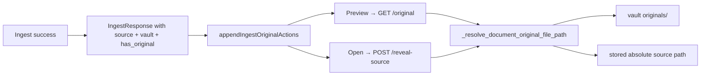

# Post-ingest document preview / open

## What already exists

You do not need new file-serving logic. The app already resolves “where is the original?” and serves it:

```1931:1980:app/main.py
def _resolve_document_original_file_path(conn: Any, doc_id: str) -> Path:
    raw = get_document_source(conn, doc_id)
    vault_rel = get_document_original_vault_path(conn, doc_id)
    p = _path_from_document_source(raw)
    if p is None and vault_rel:
        p = originals_vault_mod.absolute_from_vault_relative(vault_rel)
    ...
    if not p.exists():
        raise HTTPException(status_code=404, detail=f"File not found: {p}")
```

| Action | Endpoint | Frontend helper |
|--------|----------|-----------------|
| Preview in browser tab | `GET /documents/{doc_id}/original` | `openDocumentOriginalPreview(docId)` |
| Open in OS (Preview.app, Acrobat, etc.) | `POST /documents/{doc_id}/reveal-source` | same pattern as Documents table |

Both are **localhost-only** unless `ALLOW_LOCAL_FILE_REVEAL=true` ([`app/config.py`](app/config.py)).

The **Documents** tab already renders Preview / Open buttons using [`documentMayHaveOriginalFile`](static/index.html) and [`looksLikeOpenableLocalPath`](static/index.html). Home maturity rows already expose **See letter** via [`openDocumentOriginal`](static/index.html).

## Why ingest success needs a small backend tweak

[`IngestResponse`](app/models.py) today returns `doc_id`, chunks, facts, extractions — but **not** the stored `source` or `original_vault_path`.

That matters because after a browser upload:
- The PDF bytes are saved under the vault (`originals/…`) when a vault is enabled
- The stored `source` becomes the **absolute vault path**, not the filename the browser sent
- The frontend cannot infer preview availability from the form alone after fields are cleared

So the ingest worker’s serialized job `result` dict ([`app/ingest_worker.py`](app/ingest_worker.py) ~L176) also lacks this metadata.

## Recommended approach (buttons, matching Documents tab)



### 1. Extend `IngestResponse` (backend, ~15 lines)

**Files:** [`app/models.py`](app/models.py), [`app/main.py`](app/main.py), [`app/ingest_worker.py`](app/ingest_worker.py)

Add optional fields to `IngestResponse`:

- `source: str | None` — the **effective** path/label stored in DB (absolute vault path after upload, user-pasted path, or filename fallback)
- `original_vault_path: str | None` — relative vault path when saved
- `has_openable_original: bool` — `True` when `_resolve_document_original_file_path` would succeed **right now** (file exists on disk)

In `ingest_text()` before `return IngestResponse(...)`, compute `has_openable_original` from the already-known `effective_source` and `stored_vault_rel` (same resolution order as `_resolve_document_original_file_path`, but without requiring a second DB read).

Pass these through in:
- direct `POST /ingest`, `/ingest/pdf`, `/ingest/image` responses
- ingest job `result` dict in [`app/ingest_worker.py`](app/ingest_worker.py)

No API route changes; existing `/original` and `/reveal-source` stay as-is.

### 2. Extract a shared UI helper (frontend, ~40 lines)

**File:** [`static/index.html`](static/index.html)

Create something like `appendDocumentOriginalActions(container, docId, meta)` that:
- Clears any prior action row in the container
- Shows **Preview** when `meta.has_openable_original || documentMayHaveOriginalFile({ source: meta.source, original_vault_path: meta.original_vault_path })`
- Shows **Open** when `looksLikeOpenableLocalPath(meta.source)` (stored path is absolute — vault path, user-pasted path, or watched-folder path)
- Reuses existing click handlers (same as Documents table ~L2136–2167)

Refactor the Documents table to call this helper instead of duplicating button code (optional but keeps one source of truth).

Consolidate the duplicate `openDocumentOriginal` / `openDocumentOriginalPreview` wrappers while touching this area.

### 3. Wire into post-ingest success UX

**File:** [`static/index.html`](static/index.html)

**`handleIngestSuccess(data, form, hasPdf)`**
- After setting success copy, call `appendDocumentOriginalActions(msg, data.doc_id, data)` in **both** branches (stay-on-ingest and go-home)
- Change `#ingest-message` rendering: keep the text in a child `<span>`, append a `.ingest-success-actions` div for buttons (success messages currently use `textContent`, which cannot hold buttons)

**`handleJobQueueComplete(list, formRef)`**
- For each successful job result, append actions per file (or one shared row if single file)
- Batch summary can stay as text; actions sit below it

**CSS:** small flex row under the green success banner (`.ingest-success-actions { margin-top: 0.5rem; display: flex; gap: 0.5rem; }`).

### 4. Error handling when file moved

If the user moved/deleted the file after ingest:
- Preview tab gets 404 from `/original`
- Open shows the existing alert from `reveal-source`

Optional polish: on button click, `fetch` HEAD/GET first and show a friendly “Original file not found — it may have moved. Update the path under Documents → Edit.” instead of a blank tab. Low priority; server already returns `File not found: {path}`.

## When buttons appear / don’t

| Ingest type | Preview | Open |
|-------------|---------|------|
| PDF/image upload + vault enabled | Yes (vault copy) | Yes (absolute vault path in `source`) |
| Watched folder / pending ingest | Yes | Yes (original path kept in place) |
| User pasted full path in Source field | Yes, if file still there | Yes |
| Browser upload, vault **disabled** | No (only filename stored) | No |
| Paste-only text ingest | Only if `VAULT_SAVE_TEXT_INGEST` saved a `.txt` snapshot | Same |
| Remote non-localhost UI | Hidden or disabled unless `ALLOW_LOCAL_FILE_REVEAL` | Same |

For the “assuming it hadn’t moved” case: `has_openable_original: true` at ingest time means buttons show; if the file moves later, the existing 404 handling applies.

## Scope boundaries

- **In scope:** Preview + Open buttons on ingest success (your choice), shared helper, minimal `IngestResponse` extension
- **Out of scope:** inline iframe/image embed, Home-tab toast for go-home success (Home already has **See letter** on tracked maturities/bills), new endpoints, changing vault storage behavior

## Manual test checklist

1. Drop a generic PDF with vault on → stay on Add document → success text + Preview + Open → Preview opens PDF in new tab
2. Drop a CD letter → go Home → track modal / Recently added; ingest panel still has buttons if user switches back
3. Paste `/Users/.../statement.pdf` in Source, upload → Open launches in OS default app
4. Ingest with vault disabled → success message only, no buttons
5. Move/delete file after ingest → Preview/Open fail gracefully with clear message
6. Multi-file queue, no maturity dates → batch summary + per-file Preview buttons
