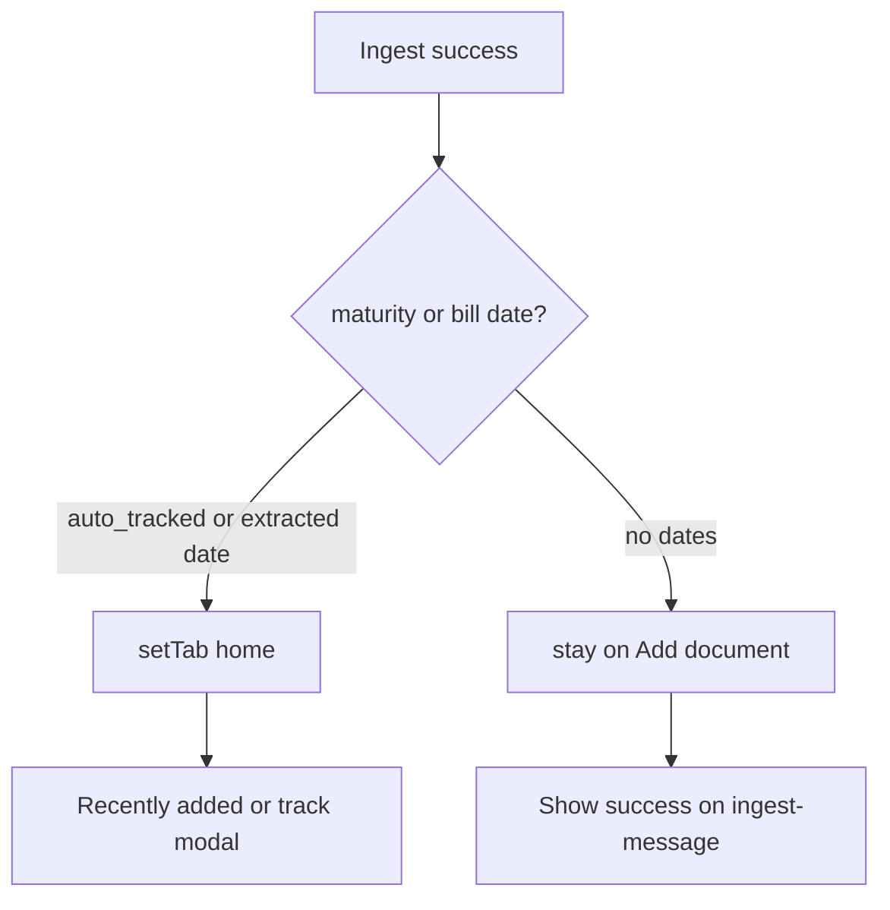

# Ingest success UX — conditional redirect

## What’s happening today

After every successful ingest, [`handleIngestSuccess`](static/index.html) and batch completion in [`handleJobQueueComplete`](static/index.html) **always** call `setTab('home')`:

```2567:2598:static/index.html
function handleIngestSuccess(data, form, hasPdf) {
  // ...
  msg.textContent = successMsg;  // written to #ingest-message on ingest panel
  // ...
  loadDashboard();
  setTab('home');  // unconditional — hides ingest panel
  // track modal / auto-track only run after redirect
}
```

For a non-maturity document:
- Ingest succeeds and the form clears
- User lands on Home (“All clear” / “No maturities tracked yet”)
- The success line (`Success! Document added: …`) is on the **hidden** ingest panel — so it feels like nothing happened

This mismatch is a UX bug, not intentional silence.

## Recommended behavior (your choice)

| Outcome | Where user lands | What they see |
|---------|------------------|---------------|
| Auto-tracked CD/bill | Home | “Recently added” row (already exists) + optional inline note |
| Extracted maturity/due date (pending confirm) | Home | Track modal (legacy fallback when auto-track off/failed) |
| General document (no dates) | **Add document** | Success message on ingest tab |

Home redirect stays for the maturity-focused happy path. General uploads get closure without the “All clear” whiplash.



## Implementation (single file, ~30 lines)

**File:** [`static/index.html`](static/index.html)

### 1. Add a small helper: `shouldGoHomeAfterIngest(data)`

Return `true` when any of:
- `data.auto_tracked_position` or `data.auto_tracked_obligation`
- `data.extracted_position?.maturity_date`
- `data.extracted_obligation?.due_date`

Return `false` for plain document saves (your random PDF case).

### 2. Update `handleIngestSuccess`

- Call `loadDashboard()` in both branches (Home data should stay fresh).
- Replace unconditional `setTab('home')` with:
  ```javascript
  if (shouldGoHomeAfterIngest(data)) {
    setTab('home');
    // existing trackedLine / showTrackModal logic
  } else {
    var friendly = 'Saved: ' + (data.doc_id || 'document') + '.';
    if (data.facts_learned && data.facts_learned.length) {
      friendly += ' Learned ' + data.facts_learned.length + ' fact(s).';
    }
    friendly += ' Ready for Ask — no maturity or bill date found.';
    msg.textContent = friendly;
    // msg already visible on ingest panel
  }
  ```

- Move track-modal / auto-track copy updates **before** or **inside** the Home branch so modal still opens on the right tab.

### 3. Update `handleJobQueueComplete` (multi-file PDF queue)

- If **any** result in the batch triggers `shouldGoHomeAfterIngest`, go Home (same as today).
- If **none** do, stay on Add document and append a summary like `Finished: file1.pdf: done | file2.pdf: done` to `#ingest-message` (already partially there — just skip `setTab('home')`).

### 4. No backend changes

[`IngestResponse`](app/models.py) already returns `doc_id`, `facts_learned`, `extracted_*`, and `auto_tracked_*` — enough to branch on.

## What we are NOT doing

- No new Home banner element (you chose stay-on-ingest for the non-maturity case)
- No change to auto-track / Recently added / track-modal logic for maturity docs
- No new tests unless you want a small JS smoke test — behavior is frontend-only

## Manual test checklist

1. Drop a random non-financial PDF → stays on Add document, green success with doc id + “Ready for Ask”
2. Drop a CD letter with maturity → goes to Home, appears under Recently added (or track modal if auto-track off)
3. Queue 2 generic PDFs → stays on Add document with batch summary
4. Queue 1 CD + 1 generic → goes Home (any maturity in batch triggers redirect)
