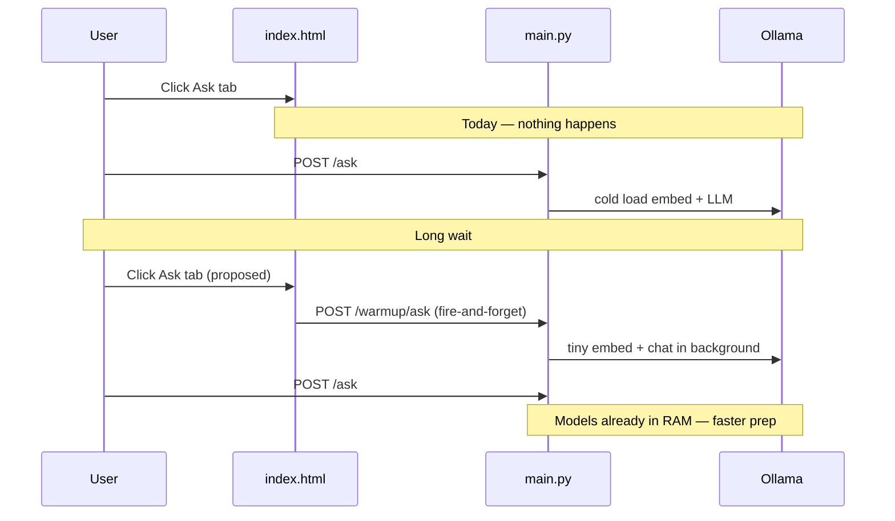

# Ollama tab warmup (Ask + Ingest)

## Problem

First Ask after idle can take several minutes because Ollama loads models lazily (`nomic-embed-text`, `qwen3:8b`). Startup only checks [`GET /health`](app/main.py); tab switches in [`static/index.html`](static/index.html) do not touch Ollama.



## Approach

### 1. New warmup module — [`app/ollama_warmup.py`](app/ollama_warmup.py)

Centralize warmup logic with a small in-process state machine:

| State | Meaning |
|-------|---------|
| `idle` | No warmup yet |
| `running` | Background task in flight |
| `ready` | Warmed within cooldown window |

**Ask warmup** (sequential, respects [`ollama_guard`](app/ollama_guard.py)):

1. `POST /api/embed` — `input: "warmup"`, model `EMBED_MODEL`, `"keep_alive": "<duration>"`
2. `POST /api/chat` — one-word prompt, model `LLM_MODEL`, `"options": {"num_predict": 1}`, `"keep_alive": "<duration>"`

**Ingest warmup**:

1. Same embed call as above (skip if Ask warmup already ran embed within cooldown)
2. `POST /api/chat` — minimal prompt, model `LLAVA_MODEL`, `num_predict: 1`, `keep_alive`

Use the same HTTP paths as [`app/embeddings_client.py`](app/embeddings_client.py) and [`app/llm_client.py`](app/llm_client.py) (`/api/embed`, `/api/chat`). Do not add a third client style.

**Config** in [`app/config.py`](app/config.py) + [`.env.example`](.env.example):

```python
OLLAMA_WARMUP_ENABLED = true          # default on
OLLAMA_WARMUP_KEEP_ALIVE = "15m"    # passed to Ollama requests
OLLAMA_WARMUP_SESSION_SEC = 900       # skip re-warm if ready within 15 min
```

**Skip rules** (return `{ "status": "ready" | "skipped" }` immediately):

- `OLLAMA_WARMUP_ENABLED` is false
- Same profile already `ready` within `OLLAMA_WARMUP_SESSION_SEC`
- Warmup already `running` (return `{ "status": "warming" }`)

On failure: log warning, set state back to `idle` (do not block the UI; real Ask/Ingest still works, just cold).

### 2. API endpoints — [`app/main.py`](app/main.py)

Add near [`GET /health`](app/main.py):

- **`POST /warmup/ask`** — start Ask warmup background task via `asyncio.create_task`, return JSON in &lt;100ms
- **`POST /warmup/ingest`** — start Ingest warmup (embed + vision); share embed step with Ask when possible
- **`GET /warmup/status`** (optional but useful for UI) — `{ ask: "idle"|"running"|"ready", ingest: "...", ready_until: ... }`

Response shape (both POST endpoints):

```json
{ "status": "started" | "warming" | "ready" | "skipped", "profile": "ask" | "ingest" }
```

No auth required (same as `/health`; localhost-only app). Warmup runs through server-side Ollama URL so Docker works without exposing Ollama to the browser.

### 3. Frontend hooks — [`static/index.html`](static/index.html)

**Tab hook** in `setTab()` (line ~1673), matching existing patterns for Home/Ingest:

```javascript
if (name === 'ask') warmupOllama('ask');
if (name === 'ingest') warmupOllama('ingest');
```

Because `setTab(saved || 'home')` runs on page load (~line 1907), returning users on the Ask tab get warmup automatically.

**`warmupOllama(profile)`**:

- Fire-and-forget `POST /warmup/{profile}` with `{ cache: 'no-store' }`
- Session debounce in `sessionStorage` (e.g. `ledgerly-warmup-ask`) so rapid tab toggling does not spam the server (belt-and-s suspenders with server cooldown)
- Ignore errors silently (warmup is best-effort)

**Subtle UI** — add two hint elements (reuse `.field-hint` / `.message loading` style):

- `#ask-warmup-hint` — under `#ask-ingest-busy` in [`panel-ask`](static/index.html)
- `#ingest-warmup-hint` — near top of Ingest panel

Copy: *"Getting AI ready… first answer may still take a moment."* Show when POST returns `started` or `warming`; hide on `ready`/`skipped` or after ~60s timeout. No blocking overlay.

### 4. Tests — `tests/test_ollama_warmup.py`

Unit tests with `httpx`/`AsyncClient` mocked (no real Ollama):

- Ask warmup calls embed then chat with `keep_alive` and `num_predict: 1`
- Ingest warmup calls embed then vision chat
- Second POST within session returns `ready`/`skipped` without new HTTP calls
- Concurrent POST while `running` returns `warming`
- `OLLAMA_WARMUP_ENABLED=False` returns `skipped`

Use FastAPI `TestClient` for endpoint smoke tests.

### 5. Docs (minimal)

One short paragraph in [`setup_and_testing.md`](setup_and_testing.md): opening Ask or Ingest preloads Ollama models in the background; first question/upload should be faster after a brief hint.

## Out of scope

- Changing Ollama `OLLAMA_KEEP_ALIVE` in [`docker-compose.yml`](docker-compose.yml) (optional ops tweak, not required)
- Warmup on Home/Manage tabs
- Blocking the tab until warmup completes
- Reducing Ask graph LLM count (separate CPU-load work already done)

## Risk / mitigation

| Risk | Mitigation |
|------|------------|
| CPU/RAM spike when opening tab | Background task; respects `ollama_guard`; session + server cooldown |
| Warmup races with real Ask/Ingest | Semaphore serializes Ollama HTTP; warmup uses minimal tokens |
| Ingest busy + warmup | Same as today — guard limits concurrency; ingest worker may wait briefly |
