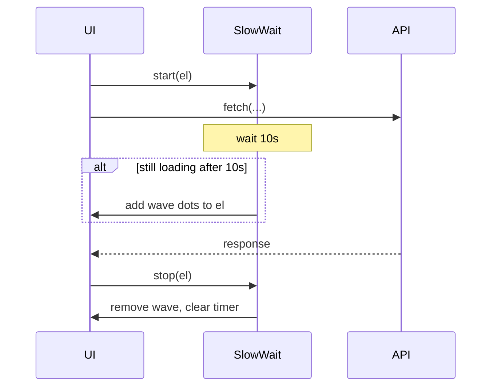

# Slow-wait wave animation

## Goal

When an operation is still in progress after **~10 seconds**, show a **cute three-dot wave** so users know the app is working—not stuck. Fast operations (&lt;10s) stay text-only (no flicker).

All work lives in [`static/index.html`](static/index.html) (inline CSS + JS; no build step).

## Design



**Wave markup** (injected once per element, hidden until active):

```html
<span class="slow-wait-wave" aria-hidden="true">
  <span></span><span></span><span></span>
</span>
```

**CSS** (new block near `.message.loading` ~line 134):

- `@keyframes slow-wait-bob` — dots bounce with staggered `animation-delay`
- `.slow-wait-wave` — inline-flex, hidden by default
- `.slow-wait-active .slow-wait-wave` — visible
- `@media (prefers-reduced-motion: reduce)` — static dots, no animation (accessibility)

**JS helper** (~line 1200, before first consumer):

```javascript
var SLOW_WAIT_MS = 10000;
var _slowWaitTimers = new WeakMap();

function ensureSlowWaitWave(el) { /* insert wave span if missing */ }

function startSlowWait(el) {
  if (!el) return;
  stopSlowWait(el);
  var t = setTimeout(function () {
    if (el.hidden) return;
    ensureSlowWaitWave(el);
    el.classList.add('slow-wait-active');
  }, SLOW_WAIT_MS);
  _slowWaitTimers.set(el, t);
}

function stopSlowWait(el) {
  if (!el) return;
  var t = _slowWaitTimers.get(el);
  if (t) { clearTimeout(t); _slowWaitTimers.delete(el); }
  el.classList.remove('slow-wait-active');
}
```

Layout: loading messages use `display: flex; align-items: center; gap: 0.5rem` when `.slow-wait-active` so text and wave sit on one line.

## Where to wire it

### High priority (commonly &gt;10s)

| Operation | Element | start | stop |
|-----------|---------|-------|------|
| App startup / health | `#app-startup-text` parent (`.app-startup-card`) | `runHealthCheck()` | `completeStartupOk()` + error path |
| Single-file ingest | `#ingest-message` | start of `doIngest` path (~2674) | success/error/`finally` + clear elapsed timer |
| Multi-file ingest queue | `#ingest-message` | after queue POST succeeds | `handleJobQueueComplete` / error |
| Ask (RAG stream) | `#ask-loading` | form submit (~2941) | first stream delta (~3018), error, stream end |
| Ask (general advice) | `#ask-general-open-loading`, `#ask-general-template-loading` | `postAskGeneral` start | success/catch |
| Vault incoming scan | `#vault-settings-message` | `runVaultIncomingScan` | response/catch |
| OpenAI maturity advice | **new** `#home-advice-loading` under “Additional suggestions” | `loadActionableAdvice` start | when advice renders or catch |

### Lower priority (usually fast, but free via same helper)

Wire the same `startSlowWait` / `stopSlowWait` pair so the 10s gate prevents noise:

- `#home-loading` — `loadDashboard`
- `#documents-loading`, `#accounts-loading`, `#positions-loading`, `#obligations-loading`, `#past-loading`
- `#ingest-create-account-message` during account creation
- `#vault-settings-summary` during `loadWatchedLibrarySettings` (text-only “Loading…” today)

### HTML additions

1. **Startup card** (~724): add empty `<div class="slow-wait-wave-host">` below the text paragraph (or wrap text + host in a flex row).
2. **Home advice** (~767): add `<div id="home-advice-loading" class="message loading" hidden>Getting additional suggestions…</div>` above `#home-openai-advice-list`.

Existing loading divs (`#ask-loading`, `#home-loading`, etc.) need no structural change—the helper injects the wave span at runtime.

## Ingest elapsed timer compatibility

Single-file ingest updates `msg.textContent` every second (~2727). The wave is a **sibling span**, not inside the text node, so elapsed updates stay safe. Ensure `ensureSlowWaitWave` runs before the first `tickIngestElapsed` call (or on first timer tick after 10s).

## Testing checklist

Manual smoke tests in browser:

1. **Fast path** — refresh Home with warm server: no wave within 10s; dashboard appears.
2. **Ask** — cold Ollama: wave appears on `#ask-loading` after ~10s; disappears on first streamed token.
3. **Ingest PDF** — drop a large scanned PDF: wave on `#ingest-message` after 10s alongside elapsed counter.
4. **Multi-file ingest** — queue 2+ files: wave during polling after 10s.
5. **Startup** — stop server, reload: wave on overlay after 10s; Retry still works.
6. **Reduced motion** — OS setting on: dots visible but static.
7. **Vault scan** — large incoming folder: wave after 10s on scan message.

No backend changes. No new dependencies.
